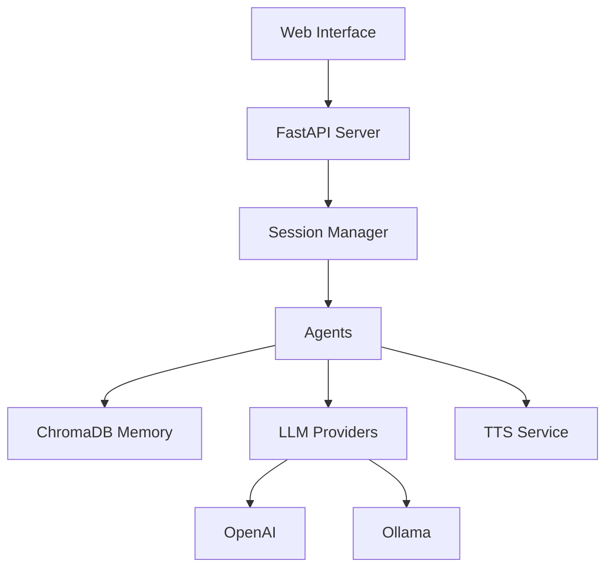

# ChatMode

**AI Agent Orchestration System with Multi-Agent Conversations, Long-Term Memory, and Voice Synthesis**

ChatMode is a Python-based platform for creating rich, multi-agent conversations. Agents with distinct personalities engage in dynamic discussions, backed by semantic memory (ChromaDB), text-to-speech synthesis, and a unified web admin console. Support for both OpenAI-compatible APIs and Ollama enables flexible deployment from cloud to local.

---

## ✨ Features

- **🤖 Multi-Agent Conversations** – Multiple AI agents with unique personalities engage in structured discussions
- **🧠 Long-Term Memory** – Semantic memory with ChromaDB vector embeddings persists across sessions with per-agent and per-session filtering
- **🎙️ Text-to-Speech** – Optional voice synthesis for agent responses using OpenAI-compatible TTS
- **🔧 Provider Flexibility** – Supports OpenAI, Ollama, and custom OpenAI-compatible endpoints
- **🌐 Unified Web Interface** – Single-page admin console for session control, live monitoring, and agent management
- **📊 Session Management** – Single active conversation model with start/stop/resume controls
- **👥 Easy Agent Creation** – Create and edit agents through web UI or JSON profiles
- **🛠️ MCP Tool Integration** – Connect agents to external tools via Model Context Protocol (MCP)
- **🎨 Custom Agent Prompts** – Fine-tune agent behavior with `extra_prompt` and `developer_prompt` fields
- **💾 Advanced Memory Management** – Per-agent memory settings, session-scoped queries, and API-based memory purging
- **🔒 Enterprise Security** – Role-based access control, comprehensive audit logging, and API key protection

---

## 🚀 Quick Start

### Installation

```bash
# Clone repository
git clone https://github.com/groxaxo/ChatMode.git
cd ChatMode

# Create virtual environment
python -m venv .venv
source .venv/bin/activate  # or `.venv\Scripts\activate` on Windows

# Install dependencies
pip install -r requirements.txt

# Configure environment
cp .env.example .env
nano .env  # Add your API keys
```

### Launch

```bash
# Start the server
uvicorn web_admin:app --host 0.0.0.0 --port 8000

# Or use the launcher
./launch.sh
```

### Access

Open your browser to **http://localhost:8000**

The unified web interface provides:
- **Session Control** – Start/stop conversations with custom topics
- **Live Monitor** – Watch agent discussions in real-time
- **Agent Overview** – View all configured agents
- **Agent Manager** – Create/edit/delete agent profiles

---

## 🚀 Advanced Features

### MCP Tool Integration

Connect agents to external systems using the Model Context Protocol (MCP). Agents can browse websites, execute code, query databases, and more.

**Example: Web Research Agent**
```json
{
  "name": "Web Researcher",
  "model": "gpt-4o",
  "api": "openai",
  "conversing": "You are a web researcher...",
  "mcp_command": "mcp-server-browsermcp",
  "allowed_tools": ["browser_navigate", "browser_screenshot"]
}
```

### Per-Agent Memory Settings

Fine-tune memory behavior for each agent:

```json
{
  "name": "Quick Agent",
  "model": "llama3.2:3b",
  "memory_top_k": 3,
  "max_context_tokens": 8192
}
```

### Custom Prompts

Enhance agent behavior with additional prompts:

- **`extra_prompt`** – Additional instructions appended to system prompt
- **`developer_prompt`** – Internal guidelines for agent behavior

### API Endpoints

**Memory Management:**
- `DELETE /api/v1/agents/{agent_id}/memory?session_id={id}` – Clear agent memory (admin/moderator)
- `POST /api/v1/memory/purge?agent_name={name}&session_id={id}` – Purge session memory (admin/moderator)

**Tool Management:**
- `GET /api/v1/tools/list?agent_name={name}` – List available MCP tools (authenticated)
- `POST /api/v1/tools/call` – Execute MCP tool manually (admin/moderator)

**Data Export:**
- `GET /api/v1/transcript/download?format=markdown|csv` – Download conversation transcript (authenticated)

See [Advanced Features Guide](docs/ADVANCED_FEATURES.md) for complete documentation.

---

## 📖 Documentation

| Guide | Description |
|-------|-------------|
| **[Setup & Deployment](docs/SETUP.md)** | Installation, Ollama setup, Docker deployment |
| **[Configuration](docs/CONFIG.md)** | Environment variables, agent profiles, tuning parameters |
| **[Architecture](docs/ARCHITECTURE.md)** | System components, data flow, design principles |
| **[Agent System](docs/AGENTS.md)** | Creating agents, personality modeling, memory system |
| **[Voice & Audio](docs/VOICE.md)** | TTS configuration, audio generation, playback |
| **[Troubleshooting](docs/TROUBLESHOOTING.md)** | Common issues, debugging, FAQ |

---

## 🎯 Usage Examples

### Start a Conversation

**Via Web UI:**
1. Go to **Session Control** tab
2. Enter topic: *"Is artificial consciousness possible?"*
3. Click **Start Session**
4. Switch to **Live Monitor** to watch the discussion

**Via CLI:**
```bash
python agent_manager.py start "Is artificial consciousness possible?"
```

### Create an Agent

**Via Web UI:**
1. Go to **Agent Manager** tab
2. Click **Create New Agent**
3. Fill in details:
   - **Name**: `Dr. Sophia Chen`
   - **Model**: `gpt-4o-mini` or `llama3.2:3b`
   - **Personality**: Define behavior in system prompt
4. Click **Save**

**Via JSON:**
```json
{
    "name": "Dr. Sophia Chen",
    "model": "gpt-4o-mini",
    "api": "openai",
    "conversing": "You are Dr. Sophia Chen, a philosopher specializing in ethics and consciousness...",
    "extra_prompt": "Always cite sources and encourage critical thinking.",
    "memory_top_k": 10,
    "max_context_tokens": 32000,
    "speak_model": {
        "voice": "nova"
    }
}
```

**With MCP Tools:**
```json
{
    "name": "Research Assistant",
    "model": "gpt-4o",
    "api": "openai",
    "conversing": "You are a research assistant with web browsing capabilities...",
    "mcp_command": "mcp-server-browsermcp",
    "allowed_tools": ["browser_navigate", "browser_screenshot"],
    "extra_prompt": "When researching, always verify information from multiple sources."
}
```

---

## 🔧 Configuration

### Basic .env Setup

```env
# LLM Provider (choose one)
OPENAI_API_KEY=sk-your-key
OLLAMA_BASE_URL=http://localhost:11434

# Embeddings
EMBEDDING_PROVIDER=ollama
EMBEDDING_MODEL=nomic-embed-text

# TTS (optional)
TTS_ENABLED=true
TTS_API_KEY=sk-your-key

# Storage
CHROMA_DIR=./data/chroma
```

See **[Configuration Guide](docs/CONFIG.md)** for all options.

---

## 🐳 Docker Deployment

```bash
# Build and run with Docker Compose
docker compose up -d

# Access at http://localhost:8000
```

The compose stack includes:
- ChatMode API server
- Ollama for local LLM inference (optional)
- Persistent volumes for data and audio

See **[Setup Guide](docs/SETUP.md#docker-deployment)** for details.

---

## 🏗️ Architecture



**Key Components:**
- **Session Manager** – Single active conversation lifecycle
- **ChatAgent** – Individual agents with personality and memory
- **MemoryStore** – Semantic memory with vector embeddings
- **Provider Abstraction** – Unified interface for OpenAI/Ollama
- **TTSClient** – Optional voice synthesis

See **[Architecture Guide](docs/ARCHITECTURE.md)** for details.

---

## 🤝 Contributing

Contributions are welcome! Please:

1. Fork the repository
2. Create a feature branch: `git checkout -b feature/amazing-feature`
3. Commit changes: `git commit -m 'Add amazing feature'`
4. Push to branch: `git push origin feature/amazing-feature`
5. Open a Pull Request

---

## 📄 License

This project is licensed under the MIT License – see the [LICENSE](LICENSE) file for details.

---

## 🙏 Acknowledgments

- **ChromaDB** – Vector database for semantic memory
- **FastAPI** – High-performance web framework
- **OpenAI** – LLM and TTS APIs
- **Ollama** – Local LLM inference

---

## 📞 Support

- **Documentation**: [docs/](docs/)
- **Issues**: [GitHub Issues](https://github.com/groxaxo/ChatMode/issues)
- **Discussions**: [GitHub Discussions](https://github.com/groxaxo/ChatMode/discussions)

---

**Ready to get started?** Check out the **[Setup Guide](docs/SETUP.md)** or jump straight in with **[Quick Start](#-quick-start)**! 🚀
