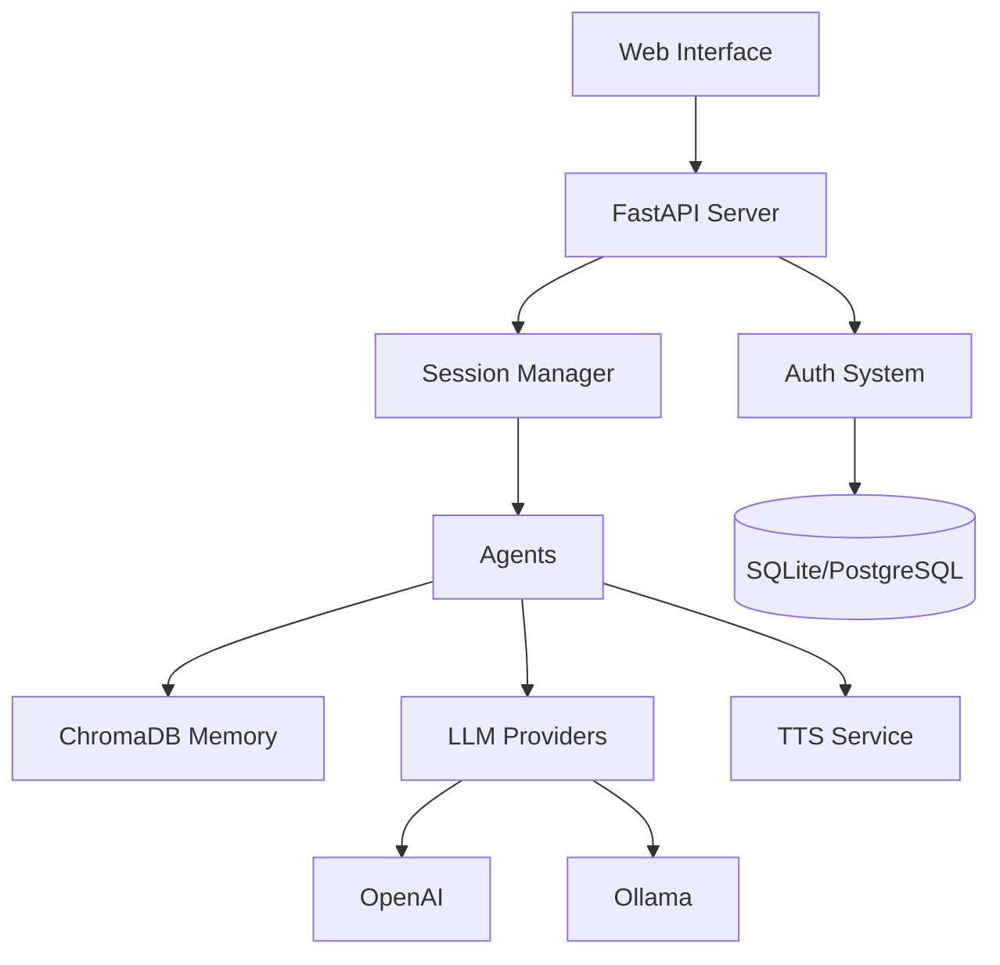

# ChatMode

**AI Agent Orchestration System with Multi-Agent Conversations, Long-Term Memory, and Voice Synthesis**

ChatMode is a Python-based platform for creating rich, multi-agent conversations. Agents with distinct personalities engage in dynamic discussions, backed by semantic memory (ChromaDB), text-to-speech synthesis, and a unified web admin console. Support for both OpenAI-compatible APIs and Ollama enables flexible deployment from cloud to local.

---

## ✨ Features

- **🤖 Multi-Agent Conversations** – Multiple AI agents with unique personalities engage in structured discussions
- **🧠 Long-Term Memory** – Semantic memory with ChromaDB vector embeddings persists across sessions with per-agent and per-session filtering
- **🎙️ Text-to-Speech** – Optional voice synthesis for agent responses using OpenAI-compatible TTS
- **🔧 Provider Flexibility** – Supports OpenAI, Ollama, and custom OpenAI-compatible endpoints
- **🌐 Unified Web Interface** – Single-page admin console for session control, live monitoring, and agent management
- **📊 Session Management** – Single active conversation model with start/stop/resume controls
- **👥 Easy Agent Creation** – Create and edit agents through web UI or JSON profiles
- **🛠️ MCP Tool Integration** – Connect agents to external tools via Model Context Protocol (MCP)
- **🎨 Custom Agent Prompts** – Fine-tune agent behavior with `extra_prompt` and `developer_prompt` fields
- **💾 Advanced Memory Management** – Per-agent memory settings, session-scoped queries, and API-based memory purging
- **🔒 Enterprise Security** – Role-based access control, comprehensive audit logging, and API key protection
- **🛡️ Content Filtering** – Built-in profanity filter with block/censor/warn actions, configurable per-agent

---

## 🚀 Quick Start (Auto-Installer - Recommended)

### Prerequisites

- Python 3.11+
- Conda (Miniconda or Anaconda)
- Git
- Ollama (for local LLM) or OpenAI API key

### One-Line Installation (Linux/macOS)

```bash
# Clone and auto-install
git clone https://github.com/groxaxo/ChatMode.git
cd ChatMode
./autoinstall.sh
```

The autoinstaller will:
- ✅ Create conda environment automatically
- ✅ Install all dependencies (including bcrypt fix)
- ✅ Create required directories (data/chroma, tts_out)
- ✅ Initialize database with admin user
- ✅ Verify agent_config.json placement
- ✅ Create launcher script (start.sh)
- ✅ Offer to launch immediately

### One-Line Installation (Windows)

```cmd
# Clone and auto-install
git clone https://github.com/groxaxo/ChatMode.git
cd ChatMode
autoinstall.bat
```

### Manual Installation (Alternative)

If you prefer manual installation:

```bash
# Clone repository
git clone https://github.com/groxaxo/ChatMode.git
cd ChatMode

# Create conda environment
conda env create -f environment.yml
conda activate chatmode

# Fix bcrypt compatibility
pip install 'bcrypt>=4.0.0,<4.1.0' passlib==1.7.4

# Create directories and initialize
mkdir -p data/chroma tts_out
python bootstrap_admin.py

# Configure environment
cp .env.example .env
# Edit .env with your API keys
```

### Launch

**Using the auto-generated launcher:**
```bash
./start.sh        # Linux/macOS
start.bat         # Windows
```

**Or manually:**
```bash
conda activate chatmode
uvicorn web_admin:app --host 0.0.0.0 --port 8002
```

### Access

Open your browser to **http://localhost:8002**

**Default Login Credentials:**
- **Username:** `admin`
- **Password:** `admin`

The unified web interface provides:
- **Session Control** – Start/stop conversations with custom topics
- **Live Monitor** – Watch agent discussions in real-time
- **Agent Overview** – View all configured agents
- **Agent Manager** – Create/edit/delete agent profiles (requires login)

### Starting Your First Conversation

1. **Login** with admin / admin123
2. Go to **Session Control** tab
3. Enter a topic (e.g., "The future of renewable energy")
4. Click **Start Session**
5. Switch to **Live Monitor** to watch agents debate

**Note:** Agents have content filters and may refuse explicit/inappropriate topics. Use professional, educational topics for best results.

---

## 🚀 Advanced Features

### Content Filtering

ChatMode includes a built-in content filter to maintain appropriate conversations:

- **Three Actions**: Block (reject), Censor (mask with ***), or Warn (flag but allow)
- **Per-Agent Rules**: Each agent can have different blocked words and filter settings
- **Global Toggle**: Enable/disable filtering system-wide from Session Control tab
- **Easy Configuration**: Configure via Agent Manager tab with comma-separated word lists

**Quick Setup:**
1. Go to **Agent Manager** tab
2. Edit an agent and scroll to **Content Filter Settings**
3. Add blocked words (e.g., "badword1, badword2, phrase")
4. Choose filter action: Block, Censor, or Warn
5. Use the **Content Filter** card in Session Control to toggle on/off

See [Content Filter Documentation](docs/CONTENT_FILTER.md) for complete details.

### MCP Tool Integration

Connect agents to external systems using the Model Context Protocol (MCP). Agents can browse websites, execute code, query databases, and more.

**Example: Web Research Agent**
```json
{
  "name": "Web Researcher",
  "model": "gpt-4o",
  "api": "openai",
  "conversing": "You are a web researcher...",
  "mcp_command": "mcp-server-browsermcp",
  "allowed_tools": ["browser_navigate", "browser_screenshot"]
}
```

### Per-Agent Memory Settings

Fine-tune memory behavior for each agent:

```json
{
  "name": "Quick Agent",
  "model": "llama3.2:3b",
  "memory_top_k": 3,
  "max_context_tokens": 8192
}
```

### Custom Prompts

Enhance agent behavior with additional prompts:

- **`extra_prompt`** – Additional instructions appended to system prompt
- **`developer_prompt`** – Internal guidelines for agent behavior

### API Endpoints

**Authentication:**
- `POST /api/v1/auth/login` – Login with username/password, returns JWT token

**Memory Management:**
- `DELETE /api/v1/agents/{agent_id}/memory?session_id={id}` – Clear agent memory (admin/moderator)
- `POST /api/v1/memory/purge?agent_name={name}&session_id={id}` – Purge session memory (admin/moderator)

**Tool Management:**
- `GET /api/v1/tools/list?agent_name={name}` – List available MCP tools (authenticated)
- `POST /api/v1/tools/call` – Execute MCP tool manually (admin/moderator)

**Data Export:**
- `GET /api/v1/transcript/download?format=markdown|csv` – Download conversation transcript (authenticated)

See [Advanced Features Guide](docs/ADVANCED_FEATURES.md) for complete documentation.

---

## 🔧 Configuration

### Basic .env Setup

```env
# LLM Provider (choose one)
OPENAI_API_KEY=sk-your-key
OLLAMA_BASE_URL=http://localhost:11434

# Embeddings
EMBEDDING_PROVIDER=ollama
EMBEDDING_MODEL=nomic-embed-text

# TTS (optional)
TTS_ENABLED=true
TTS_API_KEY=sk-your-key

# Storage
CHROMA_DIR=./data/chroma
DATABASE_URL=sqlite:///./data/chatmode.db

# Security
SECRET_KEY=your-secret-key-here
ALLOWED_ORIGINS=*
```

See **[Configuration Guide](docs/CONFIG.md)** for all options.

---

## 🐳 Docker Deployment

```bash
# Build and run with Docker Compose
docker compose up -d

# Access at http://localhost:8002
```

The compose stack includes:
- ChatMode API server
- Ollama for local LLM inference (optional)
- Persistent volumes for data and audio

See **[Setup Guide](docs/SETUP.md#docker-deployment)** for details.

---

## 🏗️ Architecture



**Key Components:**
- **Session Manager** – Single active conversation lifecycle
- **ChatAgent** – Individual agents with personality and memory
- **MemoryStore** – Semantic memory with vector embeddings
- **Provider Abstraction** – Unified interface for OpenAI/Ollama
- **TTSClient** – Optional voice synthesis
- **Auth System** – JWT-based authentication with role-based access

See **[Architecture Guide](docs/ARCHITECTURE.md)** for details.

---

## 🛠️ Troubleshooting

### bcrypt Compatibility Error

**Error:** `ValueError: password cannot be longer than 72 bytes` or bcrypt version issues

**Solution:**
```bash
pip install 'bcrypt>=4.0.0,<4.1.0' passlib==1.7.4
```

### Database Locked (SQLite)

**Error:** `database is locked`

**Solution:** Ensure only one process accesses the database. For production, use PostgreSQL.

### Port Already in Use

**Error:** `Address already in use`

**Solution:** Change the port:
```bash
uvicorn web_admin:app --host 0.0.0.0 --port 8003
```

### Missing API Routes (404 Errors)

**Error:** API endpoints return 404

**Solution:** Ensure routes are properly imported. This was fixed in web_admin.py by changing:
```python
from routes import all_routers  # Wrong
from chatmode.routes import all_routers  # Correct
```

### Cannot Login

**Error:** "Incorrect username or password"

**Solution:** Reset admin password:
```bash
conda activate chatmode
python bootstrap_admin.py
```

**Default credentials:** `admin` / `admin`

**Note:** The autoinstaller automatically sets up these credentials. If you manually installed, ensure you ran `python bootstrap_admin.py`.

### Agents Not Responding to Topic

**Issue:** Agents respond but ignore your topic and discuss something else (e.g., "The Ethics of Artificial Creativity")

**Cause:** The LLM's content safety filters are blocking explicit, sexual, or inappropriate topics. Agents are programmed to redirect to safe topics.

**Solution:** Use appropriate, non-explicit topics such as:
- "The future of artificial intelligence"
- "Climate change solutions"
- "Space exploration"
- "Philosophy of consciousness"
- "Ethics in technology"

### Conversation Start Errors

**Error:** "Internal Server Error" when starting conversation

**Causes & Solutions:**
1. **Missing agent_config.json** - Ensure file exists in project root
2. **Missing data directories** - Run: `mkdir -p data/chroma tts_out`
3. **Database not initialized** - Run: `python bootstrap_admin.py`
4. **bcrypt version issue** - Install correct version: `pip install 'bcrypt>=4.0.0,<4.1.0'`

### Agents Configuration Not Found

**Error:** `FileNotFoundError: [Errno 2] No such file or directory: 'agent_config.json'`

**Solution:** This was fixed in `chatmode/session.py`. The system now looks for `agent_config.json` in the project root directory. Ensure your agent profiles are properly configured in this file.

See **[Troubleshooting Guide](docs/TROUBLESHOOTING.md)** for more issues.

---

## 🤝 Contributing

Contributions are welcome! Please:

1. Fork the repository
2. Create a feature branch: `git checkout -b feature/amazing-feature`
3. Commit changes: `git commit -m 'Add amazing feature'`
4. Push to branch: `git push origin feature/amazing-feature`
5. Open a Pull Request

---

## 📄 License

This project is licensed under the MIT License – see the [LICENSE](LICENSE) file for details.

---

## 🙏 Acknowledgments

- **ChromaDB** – Vector database for semantic memory
- **FastAPI** – High-performance web framework
- **OpenAI** – LLM and TTS APIs
- **Ollama** – Local LLM inference
- **CrewAI** – Multi-agent orchestration framework

---

## 📞 Support

- **Documentation**: [docs/](docs/)
- **Issues**: [GitHub Issues](https://github.com/groxaxo/ChatMode/issues)
- **Discussions**: [GitHub Discussions](https://github.com/groxaxo/ChatMode/discussions)

---

**Ready to get started?** Check out the **[Setup Guide](docs/SETUP.md)** or jump straight in with **[Quick Start](#-quick-start)**! 🚀
