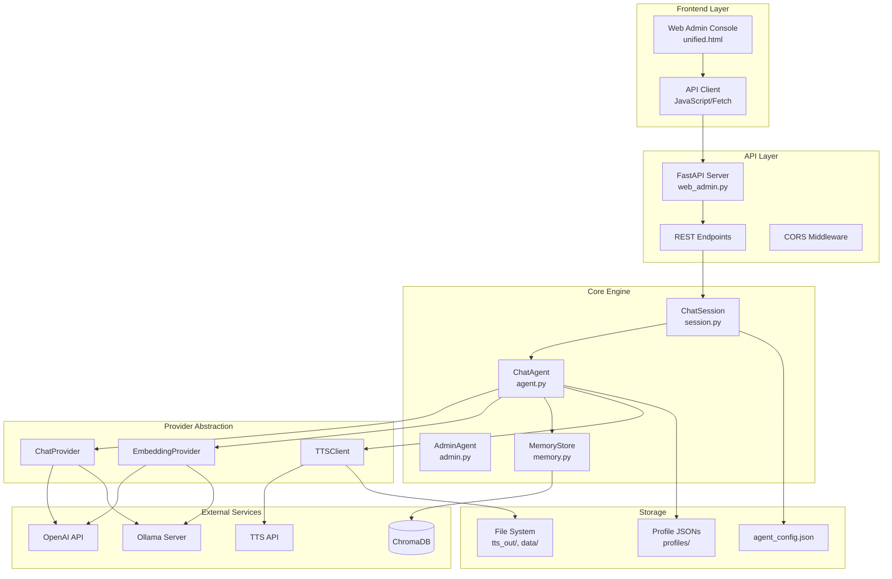
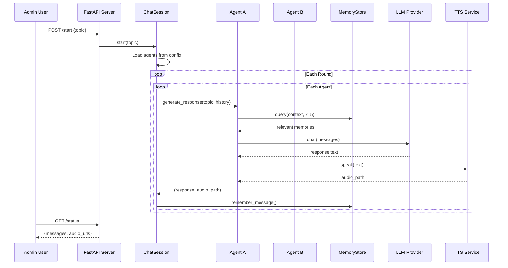
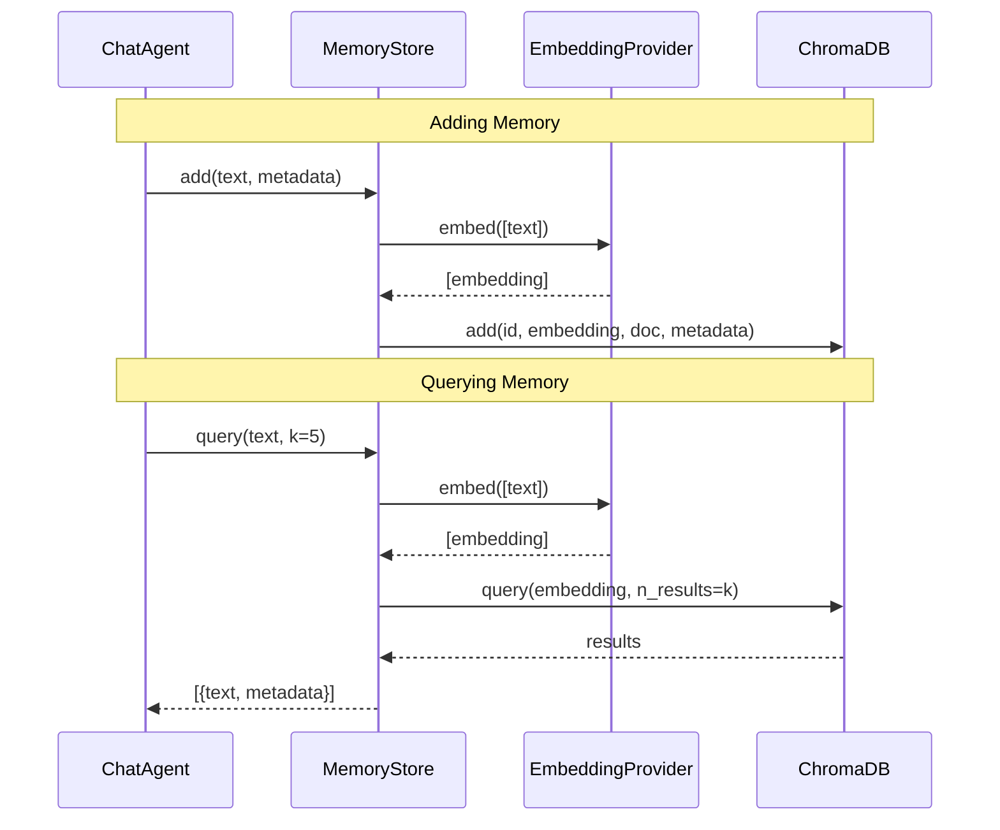
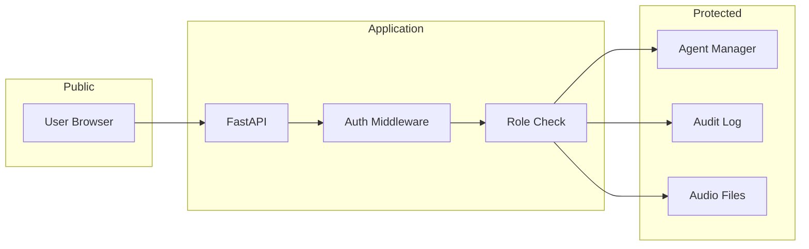

# Architecture Overview

This document describes the high-level architecture of ChatMode, including all components, their interactions, and the data flow through the system.

---

## System Components



---

## Component Descriptions

### Frontend Layer

| Component | File | Description |
|-----------|------|-------------|
| **Web Admin Console** | `frontend/unified.html` | Single-page admin interface for starting sessions, viewing messages, and managing conversations |
| **API Client** | Embedded JavaScript | Polls `/status` endpoint and renders conversation state |

### API Layer

| Component | File | Description |
|-----------|------|-------------|
| **FastAPI Server** | `web_admin.py` | Main web server hosting REST API and static files |
| **REST Endpoints** | Various routes | `/start`, `/stop`, `/status`, `/agents`, `/messages` |
| **CORS Middleware** | FastAPI middleware | Enables cross-origin requests for frontend development |

### Core Engine

| Component | File | Description |
|-----------|------|-------------|
| **ChatSession** | `session.py` | Manages conversation state, history, and agent turn-taking |
| **ChatAgent** | `agent.py` | Individual agent with personality, model config, and memory |
| **AdminAgent** | `admin.py` | Specialized agent for generating debate topics |
| **MemoryStore** | `memory.py` | Long-term semantic memory backed by ChromaDB |

### Provider Abstraction

| Component | File | Description |
|-----------|------|-------------|
| **ChatProvider** | `providers.py` | Abstract interface for LLM chat completion |
| **EmbeddingProvider** | `providers.py` | Abstract interface for text embeddings |
| **TTSClient** | `tts.py` | OpenAI-compatible TTS client |

---

## Data Flow

### Conversation Flow



### Memory Flow



---

## Directory Structure

```
ChatMode/
├── agent.py              # ChatAgent implementation
├── admin.py              # AdminAgent for topic generation
├── agent_config.json     # Active agents configuration
├── config.py             # Settings dataclass and loader
├── main.py               # CLI entry point (standalone mode)
├── memory.py             # MemoryStore (ChromaDB wrapper)
├── providers.py          # LLM/Embedding provider abstractions
├── session.py            # ChatSession state management
├── tts.py                # TTS client
├── utils.py              # Utility functions
├── web_admin.py          # FastAPI server
├── requirements.txt      # Python dependencies
├── compose.yaml          # Docker Compose configuration
├── Dockerfile            # Container build
├── .env                  # Environment variables (create from .env.example)
│
├── docs/                 # Documentation (this folder)
├── data/
│   └── chroma/           # ChromaDB persistence
├── frontend/
│   └── unified.html      # Web admin UI
├── profiles/             # Agent personality profiles
│   ├── lawyer.json
│   ├── crook.json
│   └── ...
├── templates/
│   └── admin.html        # Jinja2 fallback template
└── tts_out/              # Generated audio files
```

---

## Design Principles

### 1. Provider Abstraction
All LLM and embedding interactions go through abstract interfaces (`ChatProvider`, `EmbeddingProvider`). This allows:
- Easy switching between OpenAI and Ollama
- Support for custom endpoints
- Mock implementations for testing

### 2. Stateful Sessions
`ChatSession` maintains all conversation state in memory, with long-term persistence through ChromaDB. This enables:
- Fast round-trip for active conversations
- Durable memory across restarts
- Session resume capability

### 3. Agent Profiles as Data
Agent personalities are stored as JSON files, not code. This enables:
- Hot-reloading of personalities
- Non-developer customization
- Version-controlled personality iterations

### 4. Progressive Enhancement
The frontend works with basic HTTP requests, with JavaScript enhancing the experience. No build step required.

---

## Scalability Considerations

| Aspect | Current | Scalable Alternative |
|--------|---------|---------------------|
| Session State | In-memory | Redis/PostgreSQL |
| Message Queue | Threading | Celery/RQ |
| Audio Storage | Local filesystem | S3/Azure Blob |
| Config Storage | JSON files | Database tables |
| Multi-instance | Single process | Load balancer + shared state |

---

## Security Model



**Security layers:**
1. **CORS** – Restrict origins in production
2. **Authentication** – JWT/session tokens for admin routes
3. **RBAC** – Admin/Moderator/Viewer roles
4. **Audit Logging** – All admin actions logged
5. **Input Validation** – Pydantic schemas for all inputs
6. **File Security** – Path traversal prevention, type validation

---

*Next: [Setup & Deployment](./02-setup-deployment.md)*
