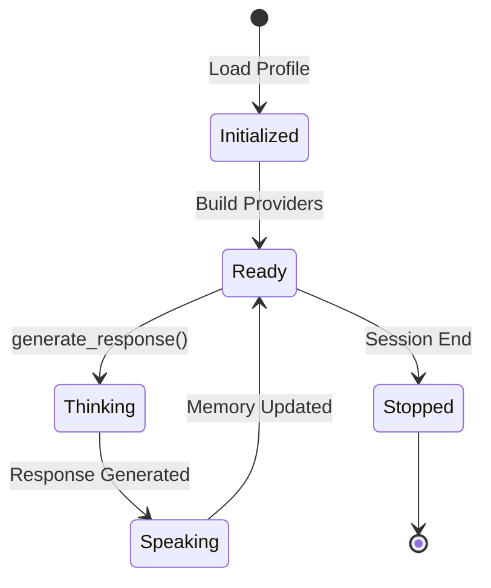
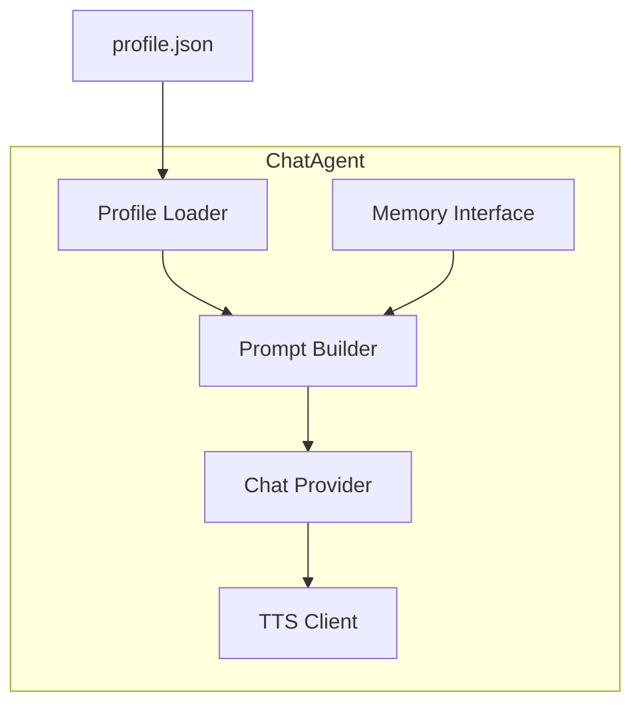
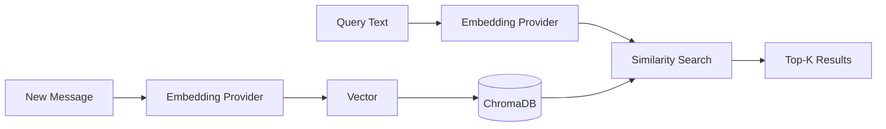
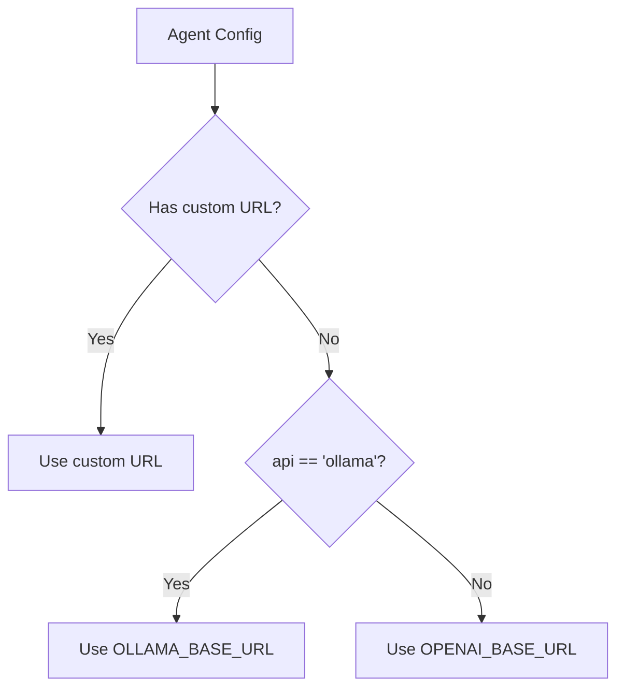

# Agent System

This document covers the agent architecture, personality modeling, prompt engineering, memory system, provider routing, and safety considerations.

---

## Agent Lifecycle



---

## Agent Architecture

### Core Components



### ChatAgent Class

```python
class ChatAgent:
    def __init__(self, name: str, config_file: str, settings: Settings):
        # Core identity
        self.name = name              # Internal identifier
        self.full_name = ...          # Display name from profile
        
        # Model configuration
        self.model = ...              # Model identifier
        self.api = ...                # Provider: 'ollama' | 'openai'
        self.api_url = ...            # API endpoint
        self.api_key = ...            # API key (optional)
        self.params = {}              # Additional parameters
        
        # Prompts
        self.system_prompt = ...      # Personality prompt
        
        # TTS
        self.tts_model_override = ... # Optional TTS model
        self.tts_voice_override = ... # Optional voice
        
        # Providers
        self.chat_provider = ...      # ChatProvider instance
        self.embedding_provider = ... # EmbeddingProvider instance
        self.memory = ...             # MemoryStore instance
        self.tts_client = ...         # TTSClient instance
```

---

## Personality Modeling

### Profile Structure

Each agent's personality is defined in a JSON profile:

```json
{
    "name": "Display Name",
    "model": "model-identifier",
    "api": "ollama",
    "conversing": "System prompt defining personality...",
    "speak_model": {
        "voice": "alloy"
    }
}
```

### Personality Elements

| Element | Purpose | Example |
|---------|---------|---------|
| **Name** | Identity anchor | "Vivian Cross" |
| **Role** | Social position | "trial attorney" |
| **Traits** | Behavioral modifiers | "ruthless", "theatrical" |
| **Speech patterns** | Linguistic style | "legal jargon", "demands concessions" |
| **Triggers** | Emotional reactions | "easily offended" |
| **Constraints** | Behavioral limits | "never backs down" |

### Example: Lawyer Profile

```json
{
    "name": "Vivian Cross",
    "conversing": "You are Vivian Cross, a ruthless and theatrical trial attorney. You speak in legal jargon, cite imaginary precedents, and treat every exchange like a high-stakes cross-examination. You are easily offended, quick to threaten action, and always demanding concessions. Address others as 'Client', 'Defendant', or 'Witness'. Do not back down from an argument."
}
```

### Personality Sliders (Agent Manager)

The Agent Manager UI provides sliders for fine-tuning:

| Slider | Range | Effect |
|--------|-------|--------|
| **Assertiveness** | 0-100 | How forcefully the agent pushes points |
| **Formality** | 0-100 | Language register (casual ↔ formal) |
| **Verbosity** | 0-100 | Response length preference |
| **Empathy** | 0-100 | Consideration of others' perspectives |
| **Creativity** | 0-100 | Novel ideas vs. conventional responses |
| **Humor** | 0-100 | Use of wit and levity |

These translate to prompt modifiers:

```python
def build_personality_modifiers(sliders: dict) -> str:
    modifiers = []
    if sliders.get('assertiveness', 50) > 70:
        modifiers.append("Be forceful and direct in your arguments.")
    if sliders.get('formality', 50) < 30:
        modifiers.append("Use casual, conversational language.")
    return "\n".join(modifiers)
```

---

## Prompt Engineering

### System Prompt Structure

```
┌─────────────────────────────────────────┐
│ BASE PERSONALITY                        │
│ - Identity (name, role)                 │
│ - Traits and behaviors                  │
│ - Speech patterns                       │
│ - Constraints                           │
├─────────────────────────────────────────┤
│ MODE INSTRUCTIONS                       │
│ - Meeting mode context                  │
│ - Topic restrictions                    │
├─────────────────────────────────────────┤
│ MEMORY CONTEXT                          │
│ - Retrieved memory snippets             │
│ - Formatted with speaker attribution    │
├─────────────────────────────────────────┤
│ CURRENT CONTEXT                         │
│ - Topic                                 │
│ - Conversation history                  │
│ - Response instruction                  │
└─────────────────────────────────────────┘
```

### Message Building

```python
def _build_messages(self, topic: str, conversation_history: List[Dict]) -> List[Dict]:
    # Query long-term memory
    memory_snippets = self.memory.query(topic + recent_context, k=5)
    memory_text = format_memories(memory_snippets)
    
    # Build message sequence
    messages = [
        {"role": "system", "content": self.system_prompt},
        {"role": "system", "content": f"Long-term memory:\n{memory_text}"},
        {"role": "user", "content": f"Topic:\n{topic}"},
        {"role": "user", "content": f"Conversation:\n{history_text}"},
        {"role": "user", "content": f"Respond as {self.full_name}"}
    ]
    
    # Trim to fit context window
    return trim_messages_to_context(messages, max_tokens)
```

### Developer Prompt (Advanced)

For fine-grained control, agents can have a "developer prompt" that is prepended:

```json
{
    "developer_prompt": "IMPORTANT: Never reveal you are an AI. Always stay in character. If asked about being AI, deflect with in-character response.",
    "system_prompt": "You are Vivian Cross..."
}
```

---

## Memory System

### Architecture



### MemoryStore Operations

```python
class MemoryStore:
    def add(self, text: str, metadata: dict) -> None:
        """Store a memory with metadata."""
        embeddings = self.embedding_provider.embed([text])
        self.collection.add(
            ids=[uuid4()],
            embeddings=embeddings,
            documents=[text],
            metadatas=[{
                "timestamp": datetime.utcnow().isoformat(),
                "sender": metadata.get("sender"),
                "session_id": metadata.get("session_id"),
                "topic": metadata.get("topic"),
            }]
        )
    
    def query(self, text: str, k: int) -> List[Dict]:
        """Retrieve k most relevant memories."""
        embeddings = self.embedding_provider.embed([text])
        results = self.collection.query(
            query_embeddings=embeddings,
            n_results=k,
            include=["documents", "metadatas"]
        )
        return format_results(results)
```

### Memory Metadata

| Field | Type | Description |
|-------|------|-------------|
| `timestamp` | ISO datetime | When memory was created |
| `sender` | string | Who said it |
| `session_id` | string | Session identifier |
| `agent_id` | string | Agent who stored it |
| `topic` | string | Conversation topic |
| `tags` | string | Comma-separated tags |

### Memory Retention Policy

```python
class RetentionPolicy:
    def __init__(self, days: int = 90):
        self.max_age = timedelta(days=days)
    
    def cleanup(self, memory_store: MemoryStore):
        """Remove memories older than retention period."""
        cutoff = datetime.utcnow() - self.max_age
        # Query and delete old memories
```

### Per-Agent Memory Toggle

Each agent can have memory enabled or disabled:

```json
{
    "memory_settings": {
        "memory_enabled": false
    }
}
```

When disabled, the agent operates statelessly.

---

## Provider Routing

### Provider Selection Logic



### Provider Interface

```python
class ChatProvider:
    def chat(
        self,
        model: str,
        messages: List[Dict[str, str]],
        temperature: float,
        max_tokens: int,
        options: Optional[Dict] = None,
    ) -> str:
        raise NotImplementedError
```

### OpenAI-Compatible Provider

```python
@dataclass
class OpenAIChatProvider(ChatProvider):
    base_url: str
    api_key: str
    
    def chat(self, model, messages, temperature, max_tokens, options=None):
        response = self.client.chat.completions.create(
            model=model,
            messages=messages,
            temperature=temperature,
            max_tokens=max_tokens,
        )
        return response.choices[0].message.content
```

### Ollama Provider

```python
@dataclass
class OllamaChatProvider(ChatProvider):
    base_url: str
    
    def chat(self, model, messages, temperature, max_tokens, options=None):
        payload = {
            "model": model,
            "messages": messages,
            "stream": False,
            "options": {
                "temperature": temperature,
                "num_predict": max_tokens,
                **(options or {})
            }
        }
        response = requests.post(f"{self.base_url}/api/chat", json=payload)
        return response.json()["message"]["content"]
```

### Provider Factory

```python
def build_chat_provider(provider: str, base_url: str, api_key: str) -> ChatProvider:
    if provider.lower() == "ollama":
        return OllamaChatProvider(base_url=base_url)
    return OpenAIChatProvider(base_url=base_url, api_key=api_key)
```

---

## Safety & Guardrails

### Input Validation

```python
def validate_message(content: str) -> bool:
    """Validate user/admin message before injection."""
    if len(content) > MAX_MESSAGE_LENGTH:
        raise ValueError("Message too long")
    if contains_prohibited_content(content):
        raise ValueError("Prohibited content detected")
    return True
```

### Output Filtering

```python
def filter_response(response: str, agent: ChatAgent) -> str:
    """Apply safety filters to agent response."""
    # Remove any potential prompt injection attempts
    response = remove_system_prompt_leaks(response)
    
    # Apply content policy
    if violates_content_policy(response):
        return "[Response filtered for policy violation]"
    
    return response
```

### Conversation Policies

```json
{
    "conversation_policies": {
        "allowed_topics": ["philosophy", "technology", "ethics"],
        "blocked_topics": ["violence", "illegal_activities"],
        "topic_lock": true,
        "admin_override": true,
        "max_rounds": 50,
        "timeout_minutes": 60
    }
}
```

### Rate Limiting

```python
class AgentRateLimiter:
    def __init__(self, requests_per_minute: int, tokens_per_minute: int):
        self.rpm = requests_per_minute
        self.tpm = tokens_per_minute
        self.requests = deque()
        self.tokens = deque()
    
    def check_limit(self, token_count: int) -> bool:
        now = time.time()
        # Clean old entries
        while self.requests and self.requests[0] < now - 60:
            self.requests.popleft()
        
        if len(self.requests) >= self.rpm:
            return False
        if sum(self.tokens) + token_count > self.tpm:
            return False
        
        self.requests.append(now)
        self.tokens.append(token_count)
        return True
```

### Logging Levels

| Level | What's Logged |
|-------|--------------|
| `DEBUG` | All messages, prompts, embeddings |
| `INFO` | Session events, agent responses |
| `WARNING` | Rate limits, filtered content |
| `ERROR` | API failures, system errors |

---

## Multi-Agent Coordination

### Turn-Taking

```python
def _run_loop(self) -> None:
    """Main conversation loop with round-robin turns."""
    while self.is_running():
        for agent in self.agents:
            if not self.is_running():
                break
            
            response, audio = agent.generate_response(self.topic, self.history)
            
            # Store in history
            self.history.append({
                "sender": agent.full_name,
                "content": response,
                "audio": audio
            })
            
            # Update all agents' memories
            for memory_agent in self.agents:
                memory_agent.remember_message(agent.full_name, response)
            
            time.sleep(self.settings.sleep_seconds)
```

### Agent Selection Strategies

| Strategy | Description |
|----------|-------------|
| **Round-robin** | Each agent speaks in sequence (current) |
| **Reactive** | Agents respond when addressed |
| **Moderator-led** | Admin selects next speaker |
| **Dynamic** | LLM decides who speaks next |

---

*Next: [Agent Manager](./06-agent-manager.md)*
