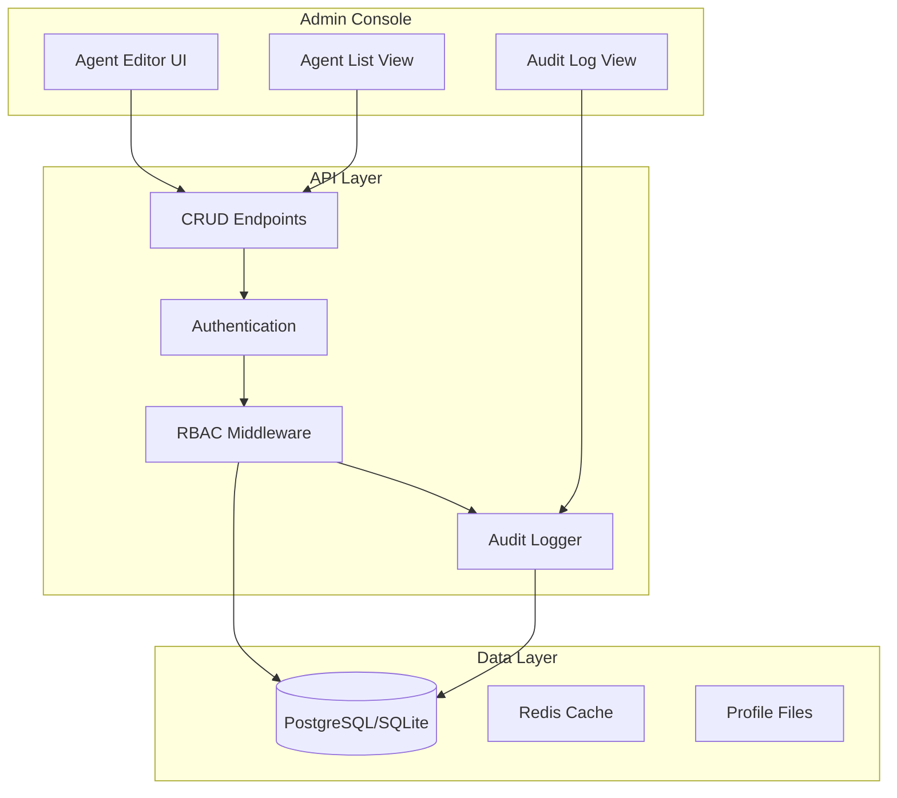

# Agent Manager

The Agent Manager is an administrative console for deep customization of AI agents. This document covers the UI, backend implementation, RBAC, and audit logging.

---

## Overview



---

## Features

### Agent Configuration

| Category | Settings |
|----------|----------|
| **Identity** | Name, display name, avatar |
| **Personality** | System prompt, personality sliders |
| **Model** | Provider, model ID, API URL, API key |
| **Generation** | Temperature, max tokens, top_p, stop sequences |
| **Voice** | TTS provider, model, voice ID, speaking rate |
| **Memory** | Enabled, embedding model, retention, top_k |
| **Permissions** | Allowed tools, rate limits, topic restrictions |

### Role-Based Access Control

| Role | Capabilities |
|------|--------------|
| **Admin** | Full CRUD, user management, delete agents, view audit log |
| **Moderator** | Edit agents, view conversations, inject messages |
| **Viewer** | Read-only access to agent configs and conversations |

### Audit Logging

Every admin action is logged:
- Who made the change
- What was changed (before/after)
- When it happened
- IP address

---

## Database Schema

### agents

```sql
CREATE TABLE agents (
    id UUID PRIMARY KEY DEFAULT gen_random_uuid(),
    name VARCHAR(100) NOT NULL UNIQUE,
    display_name VARCHAR(200),
    system_prompt TEXT,
    developer_prompt TEXT,
    model VARCHAR(200) NOT NULL,
    provider VARCHAR(50) NOT NULL DEFAULT 'ollama',
    api_url VARCHAR(500),
    api_key_encrypted VARCHAR(500),
    temperature FLOAT DEFAULT 0.9,
    max_tokens INTEGER DEFAULT 512,
    top_p FLOAT DEFAULT 1.0,
    stop_sequences TEXT[], -- JSON array
    enabled BOOLEAN DEFAULT true,
    created_at TIMESTAMP WITH TIME ZONE DEFAULT NOW(),
    updated_at TIMESTAMP WITH TIME ZONE DEFAULT NOW(),
    created_by UUID REFERENCES users(id),
    updated_by UUID REFERENCES users(id)
);

CREATE INDEX idx_agents_name ON agents(name);
CREATE INDEX idx_agents_enabled ON agents(enabled);
```

### agent_voice_settings

```sql
CREATE TABLE agent_voice_settings (
    id UUID PRIMARY KEY DEFAULT gen_random_uuid(),
    agent_id UUID NOT NULL REFERENCES agents(id) ON DELETE CASCADE,
    tts_enabled BOOLEAN DEFAULT true,
    tts_provider VARCHAR(50) DEFAULT 'openai',
    tts_model VARCHAR(100) DEFAULT 'tts-1',
    tts_voice VARCHAR(100) DEFAULT 'alloy',
    speaking_rate FLOAT DEFAULT 1.0 CHECK (speaking_rate BETWEEN 0.5 AND 2.0),
    pitch FLOAT DEFAULT 0.0 CHECK (pitch BETWEEN -1.0 AND 1.0),
    stt_enabled BOOLEAN DEFAULT false,
    stt_provider VARCHAR(50),
    stt_model VARCHAR(100),
    UNIQUE(agent_id)
);
```

### agent_memory_settings

```sql
CREATE TABLE agent_memory_settings (
    id UUID PRIMARY KEY DEFAULT gen_random_uuid(),
    agent_id UUID NOT NULL REFERENCES agents(id) ON DELETE CASCADE,
    memory_enabled BOOLEAN DEFAULT true,
    embedding_provider VARCHAR(50) DEFAULT 'ollama',
    embedding_model VARCHAR(100) DEFAULT 'nomic-embed-text',
    embedding_base_url VARCHAR(500),
    retention_days INTEGER DEFAULT 90,
    top_k INTEGER DEFAULT 5,
    UNIQUE(agent_id)
);
```

### agent_permissions

```sql
CREATE TABLE agent_permissions (
    id UUID PRIMARY KEY DEFAULT gen_random_uuid(),
    agent_id UUID NOT NULL REFERENCES agents(id) ON DELETE CASCADE,
    tool_permissions TEXT[] DEFAULT '{}',
    allowed_topics TEXT[],
    blocked_topics TEXT[],
    rate_limit_rpm INTEGER DEFAULT 60,
    rate_limit_tpm INTEGER DEFAULT 100000,
    UNIQUE(agent_id)
);
```

### users

```sql
CREATE TABLE users (
    id UUID PRIMARY KEY DEFAULT gen_random_uuid(),
    username VARCHAR(100) NOT NULL UNIQUE,
    email VARCHAR(255) UNIQUE,
    password_hash VARCHAR(255) NOT NULL,
    role VARCHAR(50) NOT NULL DEFAULT 'viewer',
    enabled BOOLEAN DEFAULT true,
    created_at TIMESTAMP WITH TIME ZONE DEFAULT NOW(),
    last_login TIMESTAMP WITH TIME ZONE
);

CREATE INDEX idx_users_username ON users(username);
CREATE INDEX idx_users_role ON users(role);
```

### audit_logs

```sql
CREATE TABLE audit_logs (
    id UUID PRIMARY KEY DEFAULT gen_random_uuid(),
    timestamp TIMESTAMP WITH TIME ZONE DEFAULT NOW(),
    user_id UUID REFERENCES users(id),
    username VARCHAR(100),
    action VARCHAR(100) NOT NULL,
    resource_type VARCHAR(50) NOT NULL,
    resource_id UUID,
    changes JSONB,
    ip_address INET,
    user_agent TEXT
);

CREATE INDEX idx_audit_timestamp ON audit_logs(timestamp);
CREATE INDEX idx_audit_user ON audit_logs(user_id);
CREATE INDEX idx_audit_action ON audit_logs(action);
CREATE INDEX idx_audit_resource ON audit_logs(resource_type, resource_id);
```

---

## Backend Implementation

### Pydantic Schemas

```python
# schemas.py
from pydantic import BaseModel, Field
from typing import Optional, List
from uuid import UUID
from datetime import datetime

class AgentBase(BaseModel):
    name: str = Field(..., min_length=1, max_length=100)
    display_name: Optional[str] = Field(None, max_length=200)
    system_prompt: Optional[str] = None
    developer_prompt: Optional[str] = None
    model: str = Field(..., min_length=1)
    provider: str = Field(default="ollama")
    api_url: Optional[str] = None
    temperature: float = Field(default=0.9, ge=0.0, le=2.0)
    max_tokens: int = Field(default=512, ge=1, le=32000)
    top_p: float = Field(default=1.0, ge=0.0, le=1.0)
    enabled: bool = True

class AgentCreate(AgentBase):
    api_key: Optional[str] = None  # Will be encrypted

class AgentUpdate(BaseModel):
    display_name: Optional[str] = None
    system_prompt: Optional[str] = None
    developer_prompt: Optional[str] = None
    model: Optional[str] = None
    provider: Optional[str] = None
    api_url: Optional[str] = None
    api_key: Optional[str] = None
    temperature: Optional[float] = None
    max_tokens: Optional[int] = None
    top_p: Optional[float] = None
    enabled: Optional[bool] = None

class AgentResponse(AgentBase):
    id: UUID
    created_at: datetime
    updated_at: datetime
    
    class Config:
        from_attributes = True

class VoiceSettings(BaseModel):
    tts_enabled: bool = True
    tts_provider: str = "openai"
    tts_model: str = "tts-1"
    tts_voice: str = "alloy"
    speaking_rate: float = Field(default=1.0, ge=0.5, le=2.0)
    pitch: float = Field(default=0.0, ge=-1.0, le=1.0)
    stt_enabled: bool = False
    stt_provider: Optional[str] = None
    stt_model: Optional[str] = None

class MemorySettings(BaseModel):
    memory_enabled: bool = True
    embedding_provider: str = "ollama"
    embedding_model: str = "nomic-embed-text"
    retention_days: int = Field(default=90, ge=1, le=365)
    top_k: int = Field(default=5, ge=1, le=50)
```

### API Routes

```python
# routes/agents.py
from fastapi import APIRouter, Depends, HTTPException, status
from sqlalchemy.orm import Session
from typing import List
from uuid import UUID

from database import get_db
from schemas import AgentCreate, AgentUpdate, AgentResponse
from auth import get_current_user, require_role
from audit import log_action
import crud

router = APIRouter(prefix="/api/v1/agents", tags=["agents"])

@router.get("/", response_model=List[AgentResponse])
async def list_agents(
    page: int = 1,
    per_page: int = 20,
    enabled: bool = None,
    db: Session = Depends(get_db),
    current_user = Depends(get_current_user)
):
    """List all agents with pagination."""
    return crud.get_agents(db, page=page, per_page=per_page, enabled=enabled)

@router.post("/", response_model=AgentResponse, status_code=status.HTTP_201_CREATED)
async def create_agent(
    agent: AgentCreate,
    db: Session = Depends(get_db),
    current_user = Depends(require_role(["admin", "moderator"]))
):
    """Create a new agent."""
    db_agent = crud.create_agent(db, agent, created_by=current_user.id)
    log_action(
        db=db,
        user=current_user,
        action="agent.create",
        resource_type="agent",
        resource_id=db_agent.id,
        changes={"created": agent.dict()}
    )
    return db_agent

@router.get("/{agent_id}", response_model=AgentResponse)
async def get_agent(
    agent_id: UUID,
    db: Session = Depends(get_db),
    current_user = Depends(get_current_user)
):
    """Get a single agent."""
    agent = crud.get_agent(db, agent_id)
    if not agent:
        raise HTTPException(status_code=404, detail="Agent not found")
    return agent

@router.put("/{agent_id}", response_model=AgentResponse)
async def update_agent(
    agent_id: UUID,
    agent_update: AgentUpdate,
    db: Session = Depends(get_db),
    current_user = Depends(require_role(["admin", "moderator"]))
):
    """Update an agent."""
    old_agent = crud.get_agent(db, agent_id)
    if not old_agent:
        raise HTTPException(status_code=404, detail="Agent not found")
    
    # Capture changes for audit
    changes = {}
    update_data = agent_update.dict(exclude_unset=True)
    for key, new_value in update_data.items():
        old_value = getattr(old_agent, key)
        if old_value != new_value:
            changes[key] = {"old": old_value, "new": new_value}
    
    updated_agent = crud.update_agent(db, agent_id, agent_update, updated_by=current_user.id)
    
    log_action(
        db=db,
        user=current_user,
        action="agent.update",
        resource_type="agent",
        resource_id=agent_id,
        changes=changes
    )
    
    return updated_agent

@router.delete("/{agent_id}")
async def delete_agent(
    agent_id: UUID,
    db: Session = Depends(get_db),
    current_user = Depends(require_role(["admin"]))
):
    """Delete an agent (soft delete)."""
    agent = crud.get_agent(db, agent_id)
    if not agent:
        raise HTTPException(status_code=404, detail="Agent not found")
    
    crud.delete_agent(db, agent_id)
    
    log_action(
        db=db,
        user=current_user,
        action="agent.delete",
        resource_type="agent",
        resource_id=agent_id,
        changes={"deleted": True}
    )
    
    return {"status": "deleted", "id": str(agent_id)}
```

### Audit Logger

```python
# audit.py
from sqlalchemy.orm import Session
from models import AuditLog
from datetime import datetime
import json

def log_action(
    db: Session,
    user,
    action: str,
    resource_type: str,
    resource_id = None,
    changes: dict = None,
    ip_address: str = None,
    user_agent: str = None
):
    """Log an administrative action."""
    audit_entry = AuditLog(
        user_id=user.id if user else None,
        username=user.username if user else "system",
        action=action,
        resource_type=resource_type,
        resource_id=resource_id,
        changes=changes,
        ip_address=ip_address,
        user_agent=user_agent
    )
    db.add(audit_entry)
    db.commit()
    return audit_entry
```

### Hot Reload Support

```python
# agent_loader.py
from sqlalchemy.orm import Session
from models import Agent, AgentVoiceSettings, AgentMemorySettings
from agent import ChatAgent
from config import Settings

class AgentLoader:
    """Load agents from database with hot-reload support."""
    
    def __init__(self, db: Session, settings: Settings):
        self.db = db
        self.settings = settings
        self._cache = {}
        self._cache_time = {}
    
    def get_agent(self, agent_id: str, force_reload: bool = False) -> ChatAgent:
        """Get agent instance, reloading from DB if changed."""
        db_agent = self.db.query(Agent).filter(Agent.id == agent_id).first()
        if not db_agent:
            raise ValueError(f"Agent {agent_id} not found")
        
        # Check if needs reload
        cache_key = str(agent_id)
        if (force_reload or 
            cache_key not in self._cache or 
            self._cache_time.get(cache_key) < db_agent.updated_at):
            
            self._cache[cache_key] = self._build_agent(db_agent)
            self._cache_time[cache_key] = db_agent.updated_at
        
        return self._cache[cache_key]
    
    def _build_agent(self, db_agent: Agent) -> ChatAgent:
        """Build ChatAgent from database model."""
        # Convert DB model to profile dict
        profile = {
            "name": db_agent.display_name or db_agent.name,
            "model": db_agent.model,
            "api": db_agent.provider,
            "url": db_agent.api_url,
            "api_key": decrypt_api_key(db_agent.api_key_encrypted),
            "params": {
                "temperature": db_agent.temperature,
            },
            "conversing": db_agent.system_prompt,
        }
        
        # Add voice settings
        if db_agent.voice_settings:
            profile["speak_model"] = {
                "model": db_agent.voice_settings.tts_model,
                "voice": db_agent.voice_settings.tts_voice,
            }
        
        # Create agent from dynamic profile
        return ChatAgent.from_dict(
            name=db_agent.name,
            profile=profile,
            settings=self.settings,
            memory_settings=db_agent.memory_settings
        )
```

---

## Frontend Implementation

### Agent Editor Component

```html
<!-- agent-editor.html (component) -->
<div class="agent-editor" data-agent-id="">
    <div class="editor-header">
        <h2>Edit Agent</h2>
        <button class="btn-save" onclick="saveAgent()">Save Changes</button>
    </div>
    
    <div class="editor-sections">
        <!-- Identity Section -->
        <section class="editor-section">
            <h3>Identity</h3>
            <div class="form-group">
                <label for="agent-name">Internal Name</label>
                <input type="text" id="agent-name" name="name" required>
            </div>
            <div class="form-group">
                <label for="display-name">Display Name</label>
                <input type="text" id="display-name" name="display_name">
            </div>
        </section>
        
        <!-- Personality Section -->
        <section class="editor-section">
            <h3>Personality</h3>
            <div class="form-group">
                <label for="system-prompt">System Prompt</label>
                <textarea id="system-prompt" name="system_prompt" rows="10"></textarea>
            </div>
            <div class="form-group">
                <label for="developer-prompt">Developer Prompt (hidden from agent)</label>
                <textarea id="developer-prompt" name="developer_prompt" rows="4"></textarea>
            </div>
            
            <!-- Personality Sliders -->
            <div class="slider-group">
                <label>Assertiveness</label>
                <input type="range" min="0" max="100" value="50" id="slider-assertiveness">
            </div>
            <div class="slider-group">
                <label>Formality</label>
                <input type="range" min="0" max="100" value="50" id="slider-formality">
            </div>
        </section>
        
        <!-- Model Section -->
        <section class="editor-section">
            <h3>Model Configuration</h3>
            <div class="form-group">
                <label for="provider">Provider</label>
                <select id="provider" name="provider">
                    <option value="ollama">Ollama</option>
                    <option value="openai">OpenAI</option>
                </select>
            </div>
            <div class="form-group">
                <label for="model">Model</label>
                <input type="text" id="model" name="model" placeholder="llama3.2:3b">
            </div>
            <div class="form-group">
                <label for="api-url">API URL</label>
                <input type="url" id="api-url" name="api_url" placeholder="http://localhost:11434">
            </div>
            <div class="form-group">
                <label for="api-key">API Key (leave blank to use default)</label>
                <input type="password" id="api-key" name="api_key">
            </div>
        </section>
        
        <!-- Generation Settings -->
        <section class="editor-section">
            <h3>Generation Settings</h3>
            <div class="form-row">
                <div class="form-group">
                    <label for="temperature">Temperature</label>
                    <input type="number" id="temperature" name="temperature" 
                           min="0" max="2" step="0.1" value="0.9">
                </div>
                <div class="form-group">
                    <label for="max-tokens">Max Tokens</label>
                    <input type="number" id="max-tokens" name="max_tokens" 
                           min="1" max="32000" value="512">
                </div>
                <div class="form-group">
                    <label for="top-p">Top P</label>
                    <input type="number" id="top-p" name="top_p" 
                           min="0" max="1" step="0.05" value="1.0">
                </div>
            </div>
        </section>
        
        <!-- Voice Settings -->
        <section class="editor-section">
            <h3>Voice Settings</h3>
            <div class="form-group">
                <label>
                    <input type="checkbox" id="tts-enabled" name="tts_enabled" checked>
                    Enable Text-to-Speech
                </label>
            </div>
            <div class="form-group">
                <label for="tts-provider">TTS Provider</label>
                <select id="tts-provider" name="tts_provider">
                    <option value="openai">OpenAI</option>
                    <option value="elevenlabs">ElevenLabs</option>
                </select>
            </div>
            <div class="form-group">
                <label for="tts-voice">Voice</label>
                <select id="tts-voice" name="tts_voice">
                    <option value="alloy">Alloy</option>
                    <option value="echo">Echo</option>
                    <option value="fable">Fable</option>
                    <option value="onyx">Onyx</option>
                    <option value="nova">Nova</option>
                    <option value="shimmer">Shimmer</option>
                </select>
            </div>
            <div class="form-group">
                <label for="speaking-rate">Speaking Rate</label>
                <input type="range" id="speaking-rate" name="speaking_rate" 
                       min="0.5" max="2.0" step="0.1" value="1.0">
                <span id="speaking-rate-value">1.0x</span>
            </div>
        </section>
        
        <!-- Memory Settings -->
        <section class="editor-section">
            <h3>Memory Settings</h3>
            <div class="form-group">
                <label>
                    <input type="checkbox" id="memory-enabled" name="memory_enabled" checked>
                    Enable Long-term Memory
                </label>
            </div>
            <div class="form-group">
                <label for="embedding-provider">Embedding Provider</label>
                <select id="embedding-provider" name="embedding_provider">
                    <option value="ollama">Ollama</option>
                    <option value="openai">OpenAI</option>
                </select>
            </div>
            <div class="form-group">
                <label for="embedding-model">Embedding Model</label>
                <input type="text" id="embedding-model" name="embedding_model" 
                       value="nomic-embed-text">
            </div>
            <div class="form-row">
                <div class="form-group">
                    <label for="retention-days">Retention (days)</label>
                    <input type="number" id="retention-days" name="retention_days" 
                           min="1" max="365" value="90">
                </div>
                <div class="form-group">
                    <label for="top-k">Memory Results (top_k)</label>
                    <input type="number" id="top-k" name="top_k" 
                           min="1" max="50" value="5">
                </div>
            </div>
            <button class="btn-danger" onclick="clearAgentMemory()">Clear Memory</button>
        </section>
        
        <!-- Permissions -->
        <section class="editor-section">
            <h3>Permissions & Limits</h3>
            <div class="form-group">
                <label>Tool Permissions</label>
                <div class="checkbox-grid">
                    <label><input type="checkbox" name="tools[]" value="web_search"> Web Search</label>
                    <label><input type="checkbox" name="tools[]" value="calculator"> Calculator</label>
                    <label><input type="checkbox" name="tools[]" value="code_exec"> Code Execution</label>
                </div>
            </div>
            <div class="form-row">
                <div class="form-group">
                    <label for="rate-rpm">Requests/min</label>
                    <input type="number" id="rate-rpm" name="rate_limit_rpm" value="60">
                </div>
                <div class="form-group">
                    <label for="rate-tpm">Tokens/min</label>
                    <input type="number" id="rate-tpm" name="rate_limit_tpm" value="100000">
                </div>
            </div>
        </section>
    </div>
</div>
```

### Agent Editor JavaScript

```javascript
// agent-editor.js
class AgentEditor {
    constructor(containerId) {
        this.container = document.getElementById(containerId);
        this.agentId = null;
        this.originalData = null;
    }
    
    async load(agentId) {
        this.agentId = agentId;
        const response = await fetch(`/api/v1/agents/${agentId}`, {
            headers: { 'Authorization': `Bearer ${getToken()}` }
        });
        
        if (!response.ok) {
            throw new Error('Failed to load agent');
        }
        
        const agent = await response.json();
        this.originalData = agent;
        this.populateForm(agent);
    }
    
    populateForm(agent) {
        document.getElementById('agent-name').value = agent.name;
        document.getElementById('display-name').value = agent.display_name || '';
        document.getElementById('system-prompt').value = agent.system_prompt || '';
        document.getElementById('developer-prompt').value = agent.developer_prompt || '';
        document.getElementById('provider').value = agent.provider;
        document.getElementById('model').value = agent.model;
        document.getElementById('api-url').value = agent.api_url || '';
        document.getElementById('temperature').value = agent.temperature;
        document.getElementById('max-tokens').value = agent.max_tokens;
        document.getElementById('top-p').value = agent.top_p;
        
        // Voice settings
        if (agent.voice_settings) {
            document.getElementById('tts-enabled').checked = agent.voice_settings.tts_enabled;
            document.getElementById('tts-provider').value = agent.voice_settings.tts_provider;
            document.getElementById('tts-voice').value = agent.voice_settings.tts_voice;
            document.getElementById('speaking-rate').value = agent.voice_settings.speaking_rate;
        }
        
        // Memory settings
        if (agent.memory_settings) {
            document.getElementById('memory-enabled').checked = agent.memory_settings.memory_enabled;
            document.getElementById('embedding-provider').value = agent.memory_settings.embedding_provider;
            document.getElementById('embedding-model').value = agent.memory_settings.embedding_model;
            document.getElementById('retention-days').value = agent.memory_settings.retention_days;
            document.getElementById('top-k').value = agent.memory_settings.top_k;
        }
    }
    
    collectFormData() {
        return {
            name: document.getElementById('agent-name').value,
            display_name: document.getElementById('display-name').value || null,
            system_prompt: document.getElementById('system-prompt').value,
            developer_prompt: document.getElementById('developer-prompt').value || null,
            provider: document.getElementById('provider').value,
            model: document.getElementById('model').value,
            api_url: document.getElementById('api-url').value || null,
            api_key: document.getElementById('api-key').value || undefined,
            temperature: parseFloat(document.getElementById('temperature').value),
            max_tokens: parseInt(document.getElementById('max-tokens').value),
            top_p: parseFloat(document.getElementById('top-p').value),
        };
    }
    
    async save() {
        const data = this.collectFormData();
        
        const response = await fetch(`/api/v1/agents/${this.agentId}`, {
            method: 'PUT',
            headers: {
                'Content-Type': 'application/json',
                'Authorization': `Bearer ${getToken()}`
            },
            body: JSON.stringify(data)
        });
        
        if (!response.ok) {
            const error = await response.json();
            throw new Error(error.error?.message || 'Save failed');
        }
        
        showToast('Agent saved successfully', 'success');
        return await response.json();
    }
}
```

---

## Audit Log View

```html
<div class="audit-log">
    <div class="audit-header">
        <h2>Audit Log</h2>
        <div class="audit-filters">
            <input type="text" placeholder="Filter by user..." id="filter-user">
            <select id="filter-action">
                <option value="">All Actions</option>
                <option value="agent.create">Agent Created</option>
                <option value="agent.update">Agent Updated</option>
                <option value="agent.delete">Agent Deleted</option>
            </select>
            <input type="date" id="filter-start">
            <input type="date" id="filter-end">
        </div>
    </div>
    
    <table class="audit-table">
        <thead>
            <tr>
                <th>Timestamp</th>
                <th>User</th>
                <th>Action</th>
                <th>Resource</th>
                <th>Changes</th>
            </tr>
        </thead>
        <tbody id="audit-body">
            <!-- Populated by JavaScript -->
        </tbody>
    </table>
</div>
```

---

*Next: [Chat & Voice](./07-chat-voice.md)*
