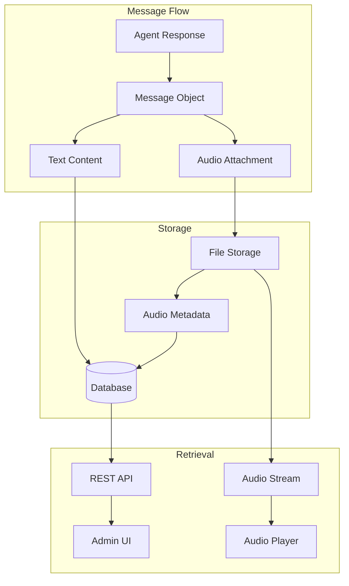
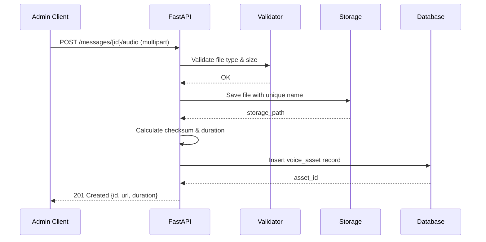

# Chat & Voice

This document covers message handling, voice attachments, audio upload/storage/playback, and admin review capabilities.

---

## Overview



---

## Message Structure

### Message Schema

```json
{
    "id": "msg_550e8400-e29b-41d4-a716-446655440000",
    "conversation_id": "conv_12345",
    "sender": "Vivian Cross",
    "sender_id": "agent_lawyer",
    "sender_type": "agent",
    "content": "From a legal standpoint, the defense's argument lacks merit...",
    "timestamp": "2026-01-30T12:00:15.000Z",
    "audio": {
        "id": "audio_abc123",
        "url": "/api/v1/audio/audio_abc123/stream",
        "duration": 12.5,
        "size_bytes": 150000,
        "mime_type": "audio/mpeg"
    },
    "metadata": {
        "model": "mistral-nemo:12b",
        "tokens_used": 256,
        "generation_time_ms": 1250
    }
}
```

### Database Schema

```sql
CREATE TABLE messages (
    id UUID PRIMARY KEY DEFAULT gen_random_uuid(),
    conversation_id UUID NOT NULL REFERENCES conversations(id) ON DELETE CASCADE,
    sender VARCHAR(200) NOT NULL,
    sender_id UUID REFERENCES agents(id),
    sender_type VARCHAR(20) NOT NULL DEFAULT 'agent',
    content TEXT NOT NULL,
    timestamp TIMESTAMP WITH TIME ZONE DEFAULT NOW(),
    model VARCHAR(200),
    tokens_used INTEGER,
    generation_time_ms INTEGER
);

CREATE INDEX idx_messages_conversation ON messages(conversation_id);
CREATE INDEX idx_messages_timestamp ON messages(timestamp);
CREATE INDEX idx_messages_sender ON messages(sender_id);
```

---

## Voice Attachments

### Audio Asset Schema

```sql
CREATE TABLE voice_assets (
    id UUID PRIMARY KEY DEFAULT gen_random_uuid(),
    message_id UUID NOT NULL REFERENCES messages(id) ON DELETE CASCADE,
    filename VARCHAR(255) NOT NULL,
    original_filename VARCHAR(255),
    storage_path VARCHAR(500) NOT NULL,
    mime_type VARCHAR(100) NOT NULL,
    size_bytes INTEGER NOT NULL,
    duration_seconds FLOAT,
    checksum VARCHAR(64),
    created_at TIMESTAMP WITH TIME ZONE DEFAULT NOW(),
    created_by UUID REFERENCES users(id),
    expires_at TIMESTAMP WITH TIME ZONE,
    UNIQUE(message_id)
);

CREATE INDEX idx_voice_message ON voice_assets(message_id);
CREATE INDEX idx_voice_expires ON voice_assets(expires_at) WHERE expires_at IS NOT NULL;
```

### Upload Flow



### Upload Implementation

```python
# routes/audio.py
from fastapi import APIRouter, UploadFile, File, HTTPException, Depends
from fastapi.responses import StreamingResponse, FileResponse
import os
import hashlib
import uuid
from pathlib import Path
import mutagen

router = APIRouter(prefix="/api/v1", tags=["audio"])

# Configuration
ALLOWED_TYPES = {"audio/mpeg", "audio/mp3", "audio/wav", "audio/ogg", "audio/webm"}
MAX_FILE_SIZE = 25 * 1024 * 1024  # 25MB
MAX_DURATION = 300  # 5 minutes
AUDIO_STORAGE_DIR = Path("./data/audio")

@router.post("/messages/{message_id}/audio", status_code=201)
async def upload_audio(
    message_id: str,
    file: UploadFile = File(...),
    db: Session = Depends(get_db),
    current_user = Depends(require_role(["admin", "moderator"]))
):
    """Upload audio attachment for a message."""
    
    # Validate message exists
    message = db.query(Message).filter(Message.id == message_id).first()
    if not message:
        raise HTTPException(status_code=404, detail="Message not found")
    
    # Check if already has audio
    existing = db.query(VoiceAsset).filter(VoiceAsset.message_id == message_id).first()
    if existing:
        raise HTTPException(status_code=409, detail="Message already has audio attachment")
    
    # Validate content type
    content_type = file.content_type
    if content_type not in ALLOWED_TYPES:
        raise HTTPException(
            status_code=422, 
            detail=f"Invalid file type. Allowed: {', '.join(ALLOWED_TYPES)}"
        )
    
    # Read file and validate size
    content = await file.read()
    if len(content) > MAX_FILE_SIZE:
        raise HTTPException(
            status_code=422,
            detail=f"File too large. Maximum size: {MAX_FILE_SIZE // (1024*1024)}MB"
        )
    
    # Generate unique filename (prevent path traversal)
    file_ext = get_extension(content_type)
    unique_filename = f"{uuid.uuid4()}{file_ext}"
    storage_path = AUDIO_STORAGE_DIR / unique_filename
    
    # Ensure storage directory exists
    AUDIO_STORAGE_DIR.mkdir(parents=True, exist_ok=True)
    
    # Write file
    with open(storage_path, "wb") as f:
        f.write(content)
    
    # Calculate checksum
    checksum = hashlib.sha256(content).hexdigest()
    
    # Get duration using mutagen
    duration = get_audio_duration(storage_path)
    if duration and duration > MAX_DURATION:
        os.remove(storage_path)
        raise HTTPException(
            status_code=422,
            detail=f"Audio too long. Maximum duration: {MAX_DURATION} seconds"
        )
    
    # Create database record
    voice_asset = VoiceAsset(
        message_id=message_id,
        filename=unique_filename,
        original_filename=file.filename,
        storage_path=str(storage_path),
        mime_type=content_type,
        size_bytes=len(content),
        duration_seconds=duration,
        checksum=checksum,
        created_by=current_user.id
    )
    db.add(voice_asset)
    db.commit()
    db.refresh(voice_asset)
    
    return {
        "id": str(voice_asset.id),
        "message_id": message_id,
        "filename": file.filename,
        "mime_type": content_type,
        "duration": duration,
        "size_bytes": len(content),
        "url": f"/api/v1/audio/{voice_asset.id}/stream",
        "created_at": voice_asset.created_at.isoformat()
    }


def get_extension(mime_type: str) -> str:
    """Get file extension from MIME type."""
    mapping = {
        "audio/mpeg": ".mp3",
        "audio/mp3": ".mp3",
        "audio/wav": ".wav",
        "audio/ogg": ".ogg",
        "audio/webm": ".webm"
    }
    return mapping.get(mime_type, ".mp3")


def get_audio_duration(path: Path) -> float:
    """Get audio duration in seconds."""
    try:
        audio = mutagen.File(path)
        if audio and audio.info:
            return audio.info.length
    except Exception:
        pass
    return None
```

### Streaming Implementation

```python
@router.get("/audio/{audio_id}/stream")
async def stream_audio(
    audio_id: str,
    request: Request,
    db: Session = Depends(get_db),
    current_user = Depends(get_current_user)
):
    """Stream audio with range support for seeking."""
    
    voice_asset = db.query(VoiceAsset).filter(VoiceAsset.id == audio_id).first()
    if not voice_asset:
        raise HTTPException(status_code=404, detail="Audio not found")
    
    file_path = Path(voice_asset.storage_path)
    if not file_path.exists():
        raise HTTPException(status_code=404, detail="Audio file missing")
    
    file_size = voice_asset.size_bytes
    
    # Handle range requests for seeking
    range_header = request.headers.get("range")
    if range_header:
        range_match = re.match(r"bytes=(\d+)-(\d*)", range_header)
        if range_match:
            start = int(range_match.group(1))
            end = int(range_match.group(2)) if range_match.group(2) else file_size - 1
            
            if start >= file_size:
                raise HTTPException(status_code=416, detail="Range not satisfiable")
            
            end = min(end, file_size - 1)
            content_length = end - start + 1
            
            def iter_file():
                with open(file_path, "rb") as f:
                    f.seek(start)
                    remaining = content_length
                    while remaining > 0:
                        chunk_size = min(8192, remaining)
                        chunk = f.read(chunk_size)
                        if not chunk:
                            break
                        remaining -= len(chunk)
                        yield chunk
            
            return StreamingResponse(
                iter_file(),
                status_code=206,
                media_type=voice_asset.mime_type,
                headers={
                    "Content-Range": f"bytes {start}-{end}/{file_size}",
                    "Accept-Ranges": "bytes",
                    "Content-Length": str(content_length),
                }
            )
    
    # Full file response
    return FileResponse(
        file_path,
        media_type=voice_asset.mime_type,
        headers={
            "Accept-Ranges": "bytes",
            "Content-Length": str(file_size),
        }
    )


@router.get("/audio/{audio_id}/download")
async def download_audio(
    audio_id: str,
    db: Session = Depends(get_db),
    current_user = Depends(get_current_user)
):
    """Download audio file."""
    
    voice_asset = db.query(VoiceAsset).filter(VoiceAsset.id == audio_id).first()
    if not voice_asset:
        raise HTTPException(status_code=404, detail="Audio not found")
    
    file_path = Path(voice_asset.storage_path)
    if not file_path.exists():
        raise HTTPException(status_code=404, detail="Audio file missing")
    
    filename = voice_asset.original_filename or voice_asset.filename
    
    return FileResponse(
        file_path,
        media_type=voice_asset.mime_type,
        filename=filename,
        headers={
            "Content-Disposition": f'attachment; filename="{filename}"'
        }
    )
```

---

## Admin Review UI

### Conversation Viewer

```html
<!-- conversation-viewer.html -->
<div class="conversation-viewer">
    <div class="conversation-header">
        <div class="conversation-info">
            <h2 id="conversation-topic">Topic: Loading...</h2>
            <span class="conversation-meta">
                <span id="message-count">0 messages</span> • 
                <span id="audio-count">0 with audio</span>
            </span>
        </div>
        <div class="conversation-actions">
            <button onclick="exportConversation()" class="btn">Export</button>
            <button onclick="deleteConversation()" class="btn btn-danger">Delete</button>
        </div>
    </div>
    
    <div class="messages-container" id="messages-container">
        <!-- Messages rendered here -->
    </div>
</div>

<style>
.message {
    display: flex;
    gap: 16px;
    padding: 16px;
    border-bottom: 1px solid var(--border);
}

.message-avatar {
    width: 48px;
    height: 48px;
    border-radius: 50%;
    background: var(--accent);
    display: flex;
    align-items: center;
    justify-content: center;
    font-weight: bold;
    flex-shrink: 0;
}

.message-body {
    flex: 1;
}

.message-header {
    display: flex;
    align-items: center;
    gap: 12px;
    margin-bottom: 8px;
}

.message-sender {
    font-weight: 600;
}

.message-time {
    color: var(--muted);
    font-size: 0.85rem;
}

.message-content {
    line-height: 1.6;
    white-space: pre-wrap;
}

.message-audio {
    margin-top: 12px;
    padding: 12px;
    background: var(--bg-2);
    border-radius: 8px;
}

.audio-player {
    display: flex;
    align-items: center;
    gap: 12px;
}

.audio-player audio {
    flex: 1;
    height: 40px;
}

.audio-meta {
    display: flex;
    gap: 16px;
    margin-top: 8px;
    font-size: 0.8rem;
    color: var(--muted);
}

.audio-download {
    color: var(--accent);
    text-decoration: none;
}

.audio-download:hover {
    text-decoration: underline;
}
</style>
```

### Audio Player Component

```javascript
// audio-player.js
class AudioPlayerController {
    constructor() {
        this.currentPlayer = null;
        this.players = new Map();
    }
    
    createPlayer(audioId, url, duration) {
        const container = document.createElement('div');
        container.className = 'message-audio';
        container.innerHTML = `
            <div class="audio-player">
                <button class="btn-play" data-audio-id="${audioId}">
                    <svg class="icon-play" viewBox="0 0 24 24">
                        <path d="M8 5v14l11-7z"/>
                    </svg>
                    <svg class="icon-pause" viewBox="0 0 24 24" style="display:none">
                        <rect x="6" y="4" width="4" height="16"/>
                        <rect x="14" y="4" width="4" height="16"/>
                    </svg>
                </button>
                <div class="audio-progress">
                    <div class="audio-progress-bar">
                        <div class="audio-progress-fill" style="width: 0%"></div>
                    </div>
                    <span class="audio-time">0:00 / ${formatDuration(duration)}</span>
                </div>
                <audio src="${url}" preload="metadata"></audio>
            </div>
            <div class="audio-meta">
                <span>Duration: ${formatDuration(duration)}</span>
                <a href="${url.replace('/stream', '/download')}" class="audio-download">Download</a>
            </div>
        `;
        
        const audio = container.querySelector('audio');
        const playBtn = container.querySelector('.btn-play');
        const progressFill = container.querySelector('.audio-progress-fill');
        const timeDisplay = container.querySelector('.audio-time');
        const progressBar = container.querySelector('.audio-progress-bar');
        
        // Play/Pause
        playBtn.addEventListener('click', () => {
            if (audio.paused) {
                // Pause any other playing audio
                if (this.currentPlayer && this.currentPlayer !== audio) {
                    this.currentPlayer.pause();
                }
                audio.play();
                this.currentPlayer = audio;
            } else {
                audio.pause();
            }
        });
        
        // Update UI on play/pause
        audio.addEventListener('play', () => {
            playBtn.querySelector('.icon-play').style.display = 'none';
            playBtn.querySelector('.icon-pause').style.display = 'block';
        });
        
        audio.addEventListener('pause', () => {
            playBtn.querySelector('.icon-play').style.display = 'block';
            playBtn.querySelector('.icon-pause').style.display = 'none';
        });
        
        // Update progress
        audio.addEventListener('timeupdate', () => {
            const progress = (audio.currentTime / audio.duration) * 100;
            progressFill.style.width = `${progress}%`;
            timeDisplay.textContent = `${formatDuration(audio.currentTime)} / ${formatDuration(audio.duration)}`;
        });
        
        // Seek on click
        progressBar.addEventListener('click', (e) => {
            const rect = progressBar.getBoundingClientRect();
            const percent = (e.clientX - rect.left) / rect.width;
            audio.currentTime = percent * audio.duration;
        });
        
        this.players.set(audioId, { container, audio });
        return container;
    }
    
    stopAll() {
        for (const [id, { audio }] of this.players) {
            audio.pause();
            audio.currentTime = 0;
        }
        this.currentPlayer = null;
    }
}

function formatDuration(seconds) {
    if (!seconds || isNaN(seconds)) return '0:00';
    const mins = Math.floor(seconds / 60);
    const secs = Math.floor(seconds % 60);
    return `${mins}:${secs.toString().padStart(2, '0')}`;
}

// Global instance
const audioController = new AudioPlayerController();
```

### Message Renderer

```javascript
// message-renderer.js
function renderMessage(message) {
    const div = document.createElement('div');
    div.className = 'message';
    div.dataset.messageId = message.id;
    
    const initials = message.sender.split(' ')
        .map(w => w[0])
        .join('')
        .slice(0, 2)
        .toUpperCase();
    
    div.innerHTML = `
        <div class="message-avatar">${initials}</div>
        <div class="message-body">
            <div class="message-header">
                <span class="message-sender">${escapeHtml(message.sender)}</span>
                <span class="message-time">${formatTime(message.timestamp)}</span>
            </div>
            <div class="message-content">${escapeHtml(message.content)}</div>
        </div>
    `;
    
    // Add audio player if present
    if (message.audio) {
        const audioPlayer = audioController.createPlayer(
            message.audio.id,
            message.audio.url,
            message.audio.duration
        );
        div.querySelector('.message-body').appendChild(audioPlayer);
    }
    
    return div;
}

async function loadConversation(conversationId) {
    const response = await fetch(`/api/v1/conversations/${conversationId}`, {
        headers: { 'Authorization': `Bearer ${getToken()}` }
    });
    
    if (!response.ok) {
        throw new Error('Failed to load conversation');
    }
    
    const conversation = await response.json();
    
    // Update header
    document.getElementById('conversation-topic').textContent = `Topic: ${conversation.topic}`;
    document.getElementById('message-count').textContent = `${conversation.messages.length} messages`;
    
    const audioCount = conversation.messages.filter(m => m.audio).length;
    document.getElementById('audio-count').textContent = `${audioCount} with audio`;
    
    // Render messages
    const container = document.getElementById('messages-container');
    container.innerHTML = '';
    
    for (const message of conversation.messages) {
        container.appendChild(renderMessage(message));
    }
}
```

---

## Security

### File Validation

```python
import magic

def validate_audio_file(content: bytes, claimed_type: str) -> bool:
    """Validate file content matches claimed MIME type."""
    
    # Check magic bytes
    detected_type = magic.from_buffer(content, mime=True)
    
    # Allow some flexibility in detection
    type_mapping = {
        "audio/mpeg": ["audio/mpeg", "audio/mp3"],
        "audio/mp3": ["audio/mpeg", "audio/mp3"],
        "audio/wav": ["audio/wav", "audio/x-wav"],
        "audio/ogg": ["audio/ogg", "audio/vorbis"],
        "audio/webm": ["audio/webm", "video/webm"],  # WebM can be detected as video
    }
    
    allowed = type_mapping.get(claimed_type, [claimed_type])
    return detected_type in allowed
```

### Path Traversal Prevention

```python
def safe_filename(filename: str) -> str:
    """Sanitize filename to prevent path traversal."""
    # Remove directory components
    filename = os.path.basename(filename)
    
    # Remove dangerous characters
    filename = re.sub(r'[^\w\-.]', '_', filename)
    
    # Limit length
    if len(filename) > 200:
        name, ext = os.path.splitext(filename)
        filename = name[:200-len(ext)] + ext
    
    return filename
```

### Access Control

```python
def check_audio_access(user, voice_asset, db) -> bool:
    """Check if user can access audio file."""
    
    # Admins can access everything
    if user.role == "admin":
        return True
    
    # Moderators can access non-private conversations
    if user.role == "moderator":
        conversation = get_conversation(db, voice_asset.message.conversation_id)
        return not conversation.is_private
    
    # Viewers need explicit permission
    return False
```

---

## Retention & Cleanup

### Retention Policy

```python
# cleanup.py
from datetime import datetime, timedelta
from pathlib import Path

class AudioRetentionPolicy:
    def __init__(self, retention_days: int = 30):
        self.retention_days = retention_days
    
    def cleanup_expired(self, db: Session):
        """Delete audio files past retention period."""
        cutoff = datetime.utcnow() - timedelta(days=self.retention_days)
        
        # Find expired assets
        expired = db.query(VoiceAsset).filter(
            VoiceAsset.created_at < cutoff
        ).all()
        
        deleted_count = 0
        freed_bytes = 0
        
        for asset in expired:
            # Delete file
            file_path = Path(asset.storage_path)
            if file_path.exists():
                freed_bytes += file_path.stat().st_size
                file_path.unlink()
            
            # Delete record
            db.delete(asset)
            deleted_count += 1
        
        db.commit()
        
        return {
            "deleted_count": deleted_count,
            "freed_bytes": freed_bytes,
            "cutoff_date": cutoff.isoformat()
        }
```

### Scheduled Cleanup

```python
# scheduler.py
from apscheduler.schedulers.asyncio import AsyncIOScheduler

scheduler = AsyncIOScheduler()

@scheduler.scheduled_job('cron', hour=3, minute=0)
async def daily_audio_cleanup():
    """Run audio cleanup daily at 3 AM."""
    from database import SessionLocal
    from cleanup import AudioRetentionPolicy
    
    db = SessionLocal()
    try:
        policy = AudioRetentionPolicy(retention_days=30)
        result = policy.cleanup_expired(db)
        logger.info(f"Audio cleanup: {result}")
    finally:
        db.close()
```

---

## Storage Options

### Local Storage (Default)

```python
AUDIO_STORAGE_DIR = Path("./data/audio")

def store_local(content: bytes, filename: str) -> str:
    AUDIO_STORAGE_DIR.mkdir(parents=True, exist_ok=True)
    path = AUDIO_STORAGE_DIR / filename
    with open(path, "wb") as f:
        f.write(content)
    return str(path)
```

### S3/Azure Blob (Production)

```python
# storage_s3.py
import boto3
from botocore.config import Config

class S3AudioStorage:
    def __init__(self, bucket: str, region: str):
        self.bucket = bucket
        self.s3 = boto3.client('s3', region_name=region)
    
    def store(self, content: bytes, key: str, content_type: str) -> str:
        self.s3.put_object(
            Bucket=self.bucket,
            Key=f"audio/{key}",
            Body=content,
            ContentType=content_type
        )
        return f"s3://{self.bucket}/audio/{key}"
    
    def get_signed_url(self, key: str, expiry: int = 3600) -> str:
        return self.s3.generate_presigned_url(
            'get_object',
            Params={'Bucket': self.bucket, 'Key': f"audio/{key}"},
            ExpiresIn=expiry
        )
```

---

*Next: [Troubleshooting & FAQ](./08-troubleshooting.md)*
