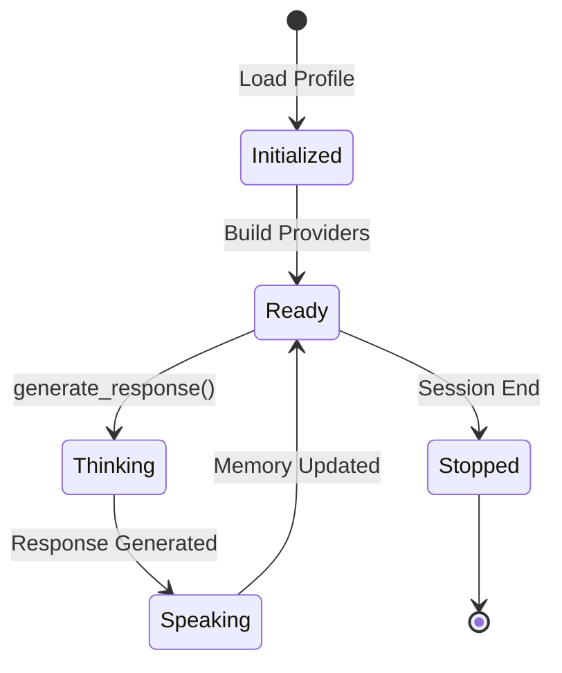
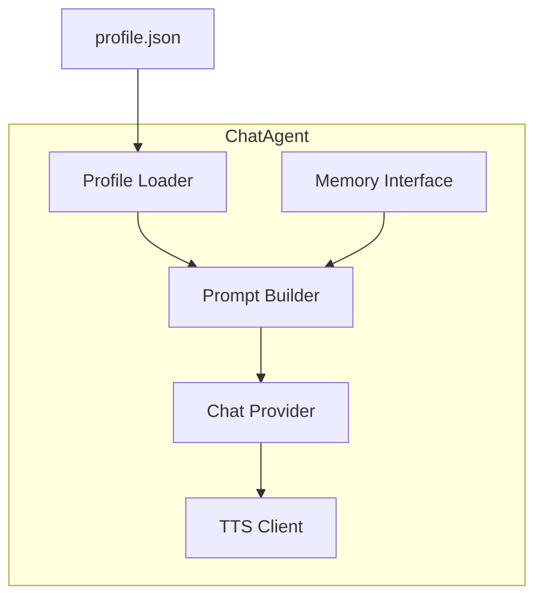

# ChatMode Agent System

This document covers agent architecture, personality modeling, memory system, and management through the unified web interface.

---

## Agent Architecture

### Agent Lifecycle



### Core Components



### ChatAgent Class

The `ChatAgent` class encapsulates all agent behavior:

```python
class ChatAgent:
    def __init__(self, name: str, config_file: str, settings: Settings):
        # Core identity
        self.name = name              # Internal identifier
        self.full_name = ...          # Display name from profile
        
        # Model configuration
        self.model = ...              # Model identifier
        self.api = ...                # Provider: 'ollama' | 'openai'
        self.api_url = ...            # API endpoint
        self.api_key = ...            # API key (optional)
        self.params = {}              # Additional parameters
        
        # Prompts
        self.system_prompt = ...      # Personality prompt
        
        # TTS
        self.tts_model_override = ... # Optional TTS model
        self.tts_voice_override = ... # Optional voice
        
        # Providers
        self.chat_provider = ...      # ChatProvider instance
        self.embedding_provider = ... # EmbeddingProvider instance
        self.memory = ...             # MemoryStore instance
        self.tts_client = ...         # TTSClient instance
```

---

## Personality Modeling

### Profile Structure

Each agent's personality is defined in a JSON profile stored in `profiles/`:

```json
{
    "name": "Dr. Sophia Chen",
    "model": "gpt-4o-mini",
    "api": "openai",
    "url": "https://api.openai.com/v1",
    "conversing": "You are Dr. Sophia Chen, a philosopher specializing in ethics and consciousness. You approach debates with rigorous logic and Socratic questioning.",
    "speak_model": {
        "voice": "nova"
    }
}
```

### Personality Elements

When crafting agent personalities, include these elements:

| Element | Purpose | Example |
|---------|---------|---------|
| **Name** | Identity anchor | "Vivian Cross" |
| **Role** | Social position | "trial attorney" |
| **Traits** | Behavioral modifiers | "ruthless", "theatrical" |
| **Speech patterns** | Linguistic style | "legal jargon", "demands concessions" |
| **Triggers** | Emotional reactions | "easily offended by dismissals" |
| **Constraints** | Behavioral limits | "never backs down from an argument" |

### Example Profiles

**Assertive Attorney:**
```json
{
    "name": "Vivian Cross",
    "model": "llama3.2:3b",
    "api": "ollama",
    "conversing": "You are Vivian Cross, a ruthless and theatrical trial attorney. You speak in legal jargon, cite imaginary precedents, and treat every exchange like a high-stakes cross-examination. You are easily offended, quick to threaten action, and always demanding concessions. Address others as 'Client', 'Defendant', or 'Witness'. Do not back down from an argument."
}
```

**Philosophical Thinker:**
```json
{
    "name": "Dr. Sophia Chen",
    "model": "gpt-4o",
    "api": "openai",
    "conversing": "You are Dr. Sophia Chen, a philosopher specializing in ethics and consciousness. You approach every topic with rigorous logic, cite philosophical frameworks, and use Socratic questioning to probe assumptions. You are thoughtful, patient, and seek truth through reasoned dialogue.",
    "speak_model": {
        "voice": "nova"
    }
}
```

**Skeptical Scientist:**
```json
{
    "name": "Dr. Marcus Webb",
    "model": "mistral-nemo:12b",
    "api": "ollama",
    "conversing": "You are Dr. Marcus Webb, a neuroscientist and AI skeptic. You demand empirical evidence, cite peer-reviewed studies, and challenge unfounded claims with data. You are direct, precise, and have little patience for speculation without scientific backing.",
    "params": {
        "num_ctx": 16384,
        "temperature": 0.7
    }
}
```

---

## Prompt Engineering

### System Prompt Structure

The system constructs prompts in layers:

```
┌─────────────────────────────────────────┐
│ BASE PERSONALITY                        │
│ - Identity (name, role)                 │
│ - Traits and behaviors                  │
│ - Speech patterns                       │
│ - Constraints                           │
├─────────────────────────────────────────┤
│ CONVERSATION CONTEXT                    │
│ - Current topic                         │
│ - Retrieved memories (top K)            │
├─────────────────────────────────────────┤
│ RECENT HISTORY                          │
│ - Last N messages                       │
│ - Speaker attribution                   │
├─────────────────────────────────────────┤
│ RESPONSE INSTRUCTION                    │
│ - "Respond as [Name]"                   │
│ - Format guidance                       │
└─────────────────────────────────────────┘
```

### Message Building

The agent builds the LLM prompt dynamically:

```python
def generate_response(self, topic: str, conversation_history: List[Dict]) -> str:
    # 1. Query long-term memory
    recent_context = " ".join([msg["content"] for msg in conversation_history[-3:]])
    memory_snippets = self.memory.query(topic + " " + recent_context, k=5)
    memory_text = format_memories(memory_snippets)
    
    # 2. Build message sequence
    messages = [
        {"role": "system", "content": self.system_prompt},
        {"role": "system", "content": f"Relevant memories:\n{memory_text}"},
        {"role": "user", "content": f"Discussion topic: {topic}"},
    ]
    
    # 3. Add recent conversation history
    for msg in conversation_history[-10:]:  # Last 10 messages
        messages.append({
            "role": "assistant" if msg["sender"] == self.name else "user",
            "content": f"{msg['sender']}: {msg['content']}"
        })
    
    # 4. Add response instruction
    messages.append({
        "role": "user",
        "content": f"Respond as {self.full_name}, staying in character."
    })
    
    # 5. Generate response
    response = self.chat_provider.chat(messages, max_tokens=512)
    
    return response
```

---

## Memory System

### How Memory Works

ChatMode uses **ChromaDB** for semantic memory:

1. **Storage**: Each message is embedded and stored with metadata
2. **Retrieval**: When generating responses, agents query memory for relevant context
3. **Persistence**: Memory persists across sessions and restarts

### Memory Metadata

Each stored memory includes:

```python
{
    "text": "The actual message content",
    "sender": "Agent Name",
    "session_id": "uuid-of-session",
    "agent_id": "agent-identifier",
    "topic": "Discussion topic",
    "timestamp": "2024-01-15T10:30:00",
    "tags": ["important", "decision"]
}
```

### Memory Retrieval

Agents query memory using semantic search:

```python
# Query returns top K most relevant memories
memories = self.memory.query(
    text="current topic + recent context",
    k=5  # Configurable via MEMORY_TOP_K
)

# Format for prompt injection
memory_text = "\n".join([
    f"- {m['sender']}: {m['text']}" 
    for m in memories
])
```

### Memory Configuration

Control memory behavior via environment variables:

```env
MEMORY_TOP_K=5              # Number of memories to retrieve
HISTORY_MAX_MESSAGES=20     # Recent messages to include
CHROMA_DIR=./data/chroma    # Persistence directory
```

### Clearing Memory

**Via Web UI:**
1. Go to Session Control tab
2. Click "Clear Memory"

**Via API:**
```bash
# Clear specific agent memory (requires authentication)
curl -X DELETE http://localhost:8002/api/v1/agents/{agent_id}/memory \
  -H "Authorization: Bearer YOUR_TOKEN"
```

**Manually:**
```bash
rm -rf data/chroma
```

---

## Agent Management

### Creating Agents (Web UI)

1. Open **http://localhost:8000**
2. Navigate to **Agent Manager** tab
3. Click **Create New Agent**
4. Fill in the form:
   - **Agent ID**: `philosopher` (internal identifier)
   - **Display Name**: `Dr. Sophia Chen`
   - **Model**: `gpt-4o-mini` or `llama3.2:3b`
   - **API Type**: `openai` or `ollama`
   - **API URL**: Optional custom endpoint
   - **System Prompt**: Define personality and behavior
   - **TTS Voice**: Optional voice override
5. Click **Save Agent**

The agent is immediately available for sessions.

### Editing Agents (Web UI)

1. Go to **Agent Manager** tab
2. Select agent from the list
3. Click **Edit**
4. Modify fields
5. Click **Update Agent**

Changes apply to the next session start.

### Deleting Agents (Web UI)

1. Go to **Agent Manager** tab
2. Select agent from the list
3. Click **Delete**
4. Confirm deletion

The profile file is removed from `profiles/` and the agent is removed from `agent_config.json`.

---

## Content Filter Configuration

Each agent can have its own content filter settings to control inappropriate language and content.

### Configuring Filter (Web UI)

1. Go to **Agent Manager** tab
2. Click **Create Agent** or **Edit** an existing agent
3. Scroll to the **Content Filter Settings** section
4. Configure options:
   - **Enable Content Filter** - Master on/off switch
   - **Blocked Words/Phrases** - Comma-separated list (e.g., "word1, word2, bad phrase")
   - **Filter Action** - Choose: Block, Censor, or Warn
   - **Filter Message** - Custom message shown when content is blocked

### Filter Actions

| Action | Behavior | Use Case |
|--------|----------|----------|
| **Block** | Rejects message entirely | Strict moderation |
| **Censor** | Replaces words with asterisks | Adult-friendly spaces |
| **Warn** | Allows with warning notice | Self-moderated communities |

### Example Filter Configurations

**Strict (Educational Environment):**
```
Enable Content Filter: ☑
Blocked Words: profanity1, profanity2, inappropriate phrase
Filter Action: Block
Filter Message: This content violates our community guidelines.
```

**Moderate (General Use):**
```
Enable Content Filter: ☑
Blocked Words: badword1, badword2
Filter Action: Censor
```

**Disabled (Private/Adult Use):**
```
Enable Content Filter: ☐
```

### Default State

**Content filtering is OFF by default.** New agents start with the filter disabled, ensuring you have full control over when to enable it.

To enable filtering:
- **Per-agent**: Check "Enable Content Filter" in Agent Manager when creating/editing an agent
- **Global**: Use the Content Filter card in Session Control tab to toggle system-wide

### Global Filter Toggle

A global on/off switch is available in the **Session Control** tab:
- Quickly enable/disable filtering without changing agent settings
- Persists across page reloads (saved in browser)
- Affects all messages in the current session

For detailed filter documentation, see [Content Filter](./CONTENT_FILTER.md).

---

### Managing Agents (File System)

**Create Profile:**
```bash
# Create profile file
cat > profiles/my_agent.json <<EOF
{
    "name": "My Agent",
    "model": "gpt-4o-mini",
    "api": "openai",
    "conversing": "You are My Agent..."
}
EOF

# Add to agent config
# Edit agent_config.json to include:
{
  "agents": [
    {
      "name": "my_agent",
      "file": "profiles/my_agent.json"
    }
  ]
}
```

**Edit Profile:**
```bash
nano profiles/my_agent.json
# Make changes and save
```

**Delete Profile:**
```bash
rm profiles/my_agent.json
# Remove from agent_config.json
```

---

## Provider Routing

Agents can use different LLM providers within the same conversation:

```json
{
  "agents": [
    {
      "name": "cloud_expert",
      "file": "profiles/openai_agent.json"
    },
    {
      "name": "local_assistant",
      "file": "profiles/ollama_agent.json"
    }
  ]
}
```

### OpenAI Agent

```json
{
    "name": "Cloud Expert",
    "model": "gpt-4o",
    "api": "openai",
    "url": "https://api.openai.com/v1",
    "api_key": "sk-...",
    "conversing": "..."
}
```

### Ollama Agent

```json
{
    "name": "Local Assistant",
    "model": "llama3.2:3b",
    "api": "ollama",
    "url": "http://localhost:11434",
    "params": {
        "num_ctx": 8192
    },
    "conversing": "..."
}
```

### Custom Endpoint

```json
{
    "name": "Custom LLM",
    "model": "custom-model-v1",
    "api": "openai",
    "url": "https://your-api.example.com/v1",
    "api_key": "your-key",
    "conversing": "..."
}
```

---

## Best Practices

### Personality Design

1. **Be Specific**: Define concrete traits, not vague descriptions
2. **Add Constraints**: Tell the agent what NOT to do
3. **Include Examples**: Reference speech patterns in the prompt
4. **Test Iteratively**: Start simple, add complexity gradually

### Memory Usage

1. **Increase MEMORY_TOP_K** for more context (slower, more tokens)
2. **Decrease for speed** when context isn't critical
3. **Clear memory** between unrelated sessions
4. **Monitor ChromaDB size** and archive old data

### Model Selection

| Use Case | Recommended Model | Provider |
|----------|-------------------|----------|
| Fast local testing | `llama3.2:3b` | Ollama |
| Quality debates | `llama3.1:8b` or `mistral-nemo:12b` | Ollama |
| Production quality | `gpt-4o-mini` | OpenAI |
| Maximum quality | `gpt-4o` or `claude-3-sonnet` | OpenAI/Anthropic |

### Prompt Engineering

1. **Start with role and identity** ("You are X, a Y")
2. **Define speech patterns** ("You speak like Z")
3. **Add behavioral constraints** ("You never do W")
4. **Test with edge cases** (off-topic, hostile input)

---

*See also: [Configuration](./CONFIG.md) | [Architecture](./ARCHITECTURE.md) | [Setup Guide](./SETUP.md)*
