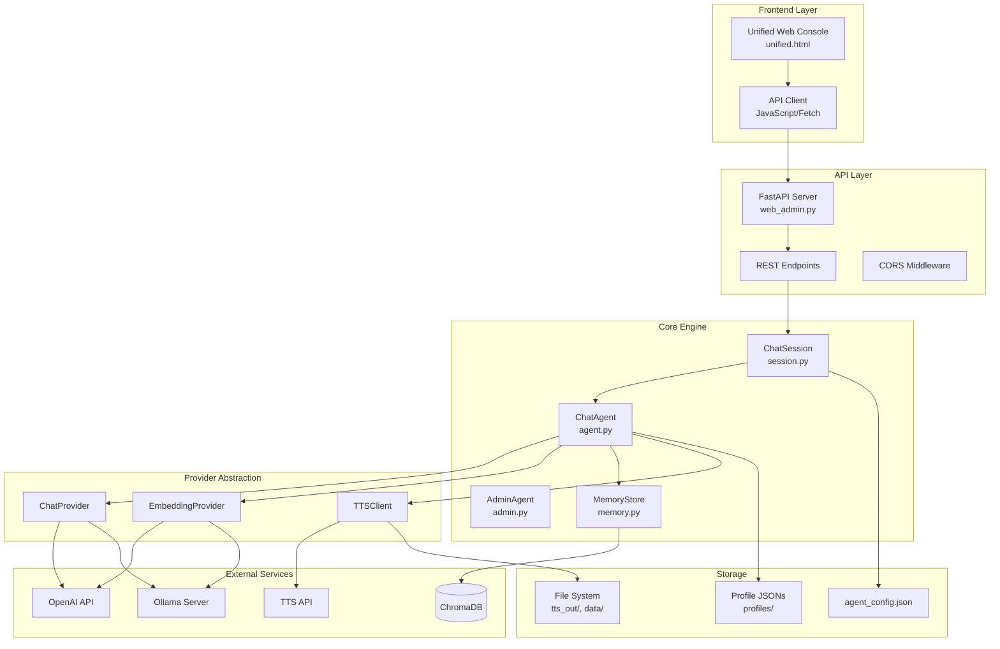
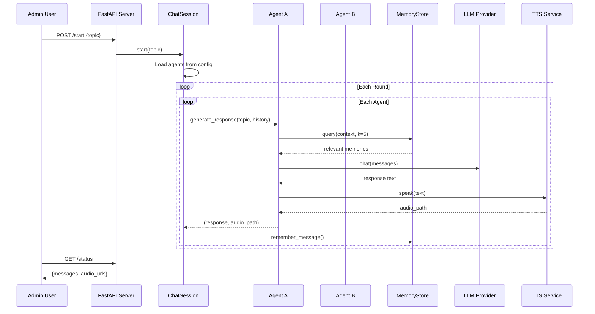
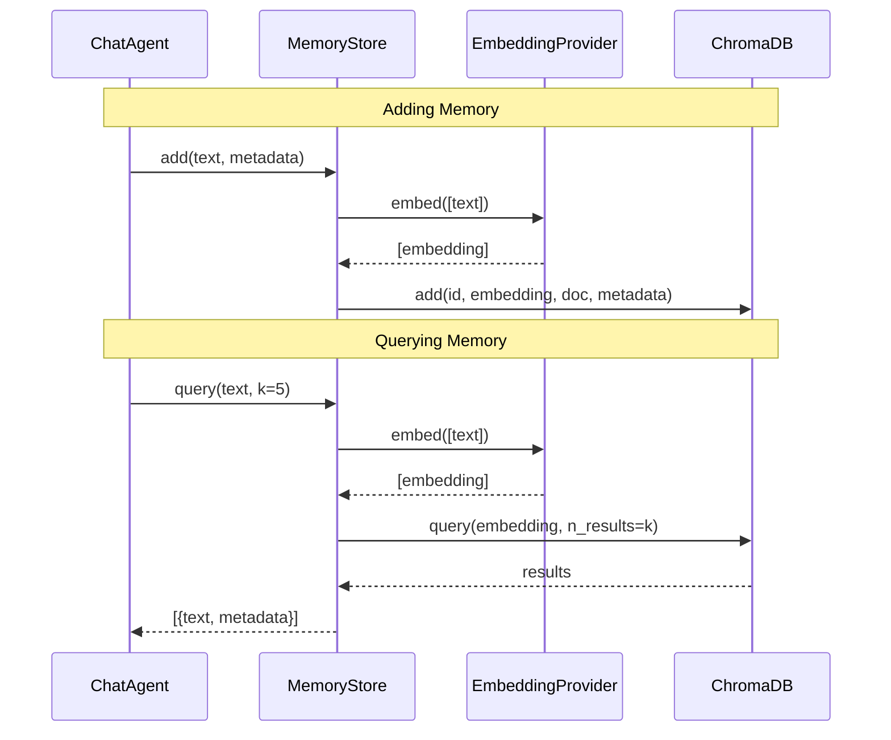
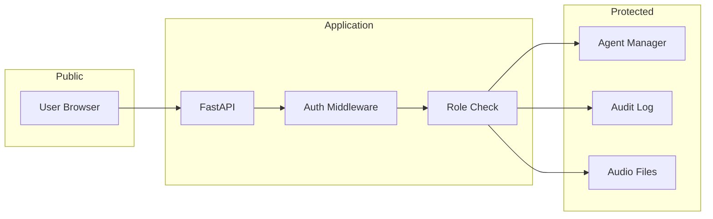

# ChatMode Architecture

This document describes the high-level architecture of ChatMode, including all components, their interactions, and the data flow through the system.

---

## Overview

ChatMode is an AI agent orchestration system that enables multi-agent conversations with long-term memory, text-to-speech synthesis, and admin oversight. The system supports both OpenAI-compatible APIs and Ollama for flexible deployment.

---

## System Components

---

## Component Descriptions

### Frontend Layer

| Component | File | Description |
|-----------|------|-------------|
| **Unified Web Console** | `frontend/unified.html` | Single-page admin interface with tabs for session control, live monitoring, agent overview, and agent management |
| **API Client** | Embedded JavaScript | Polls `/status` endpoint and renders conversation state in real-time |

### API Layer

| Component | File | Description |
|-----------|------|-------------|
| **FastAPI Server** | `web_admin.py` | Main web server hosting REST API and serving static files |
| **REST Endpoints** | `routes/*.py` | API routes for session control, agents, audio, authentication, and more |
| **CORS Middleware** | FastAPI middleware | Enables cross-origin requests for development |

### Core Engine

| Component | File | Description |
|-----------|------|-------------|
| **ChatSession** | `session.py` | Manages conversation state, history, and agent turn-taking in a single active session |
| **ChatAgent** | `agent.py` | Individual agent with personality, model configuration, and memory access |
| **AdminAgent** | `admin.py` | Specialized agent for generating debate topics |
| **MemoryStore** | `memory.py` | Long-term semantic memory backed by ChromaDB with vector embeddings |

### Provider Abstraction

| Component | File | Description |
|-----------|------|-------------|
| **ChatProvider** | `providers.py` | Abstract interface for LLM chat completion (OpenAI, Ollama) |
| **EmbeddingProvider** | `providers.py` | Abstract interface for text embeddings |
| **TTSClient** | `tts.py` | OpenAI-compatible TTS client for voice synthesis |

---

## Data Flow

### Conversation Flow

### Memory Flow

---

## Single Session Model

ChatMode is designed around a **single active conversation** at a time. This design choice:

- Simplifies state management and reduces complexity
- Ensures consistent memory and context for all agents
- Allows admin to maintain focus on one meaningful discussion
- Prevents resource contention between multiple sessions

To start a new conversation, the admin must first stop any existing session. The system automatically manages this lifecycle through the unified web interface.

---

## Design Principles

### 1. Provider Abstraction
All LLM and embedding interactions go through abstract interfaces (`ChatProvider`, `EmbeddingProvider`). This allows:
- Easy switching between OpenAI and Ollama
- Support for custom endpoints
- Mock implementations for testing

### 2. Stateful Sessions
`ChatSession` maintains all conversation state in memory, with long-term persistence through ChromaDB. This enables:
- Fast round-trip for active conversations
- Durable memory across restarts
- Session resume capability

### 3. Agent Profiles as Data
Agent personalities are stored as JSON files, not code. This enables:
- Hot-reloading of personalities
- Non-developer customization through the web UI
- Version-controlled personality iterations

### 4. Progressive Enhancement
The frontend works with basic HTTP requests, with JavaScript enhancing the experience. No build step required.

---

## Security Model

**Security layers:**
1. **CORS** – Restrict origins in production
2. **Authentication** – JWT/session tokens for admin routes
3. **RBAC** – Admin/Moderator/Viewer roles
4. **Audit Logging** – All admin actions logged
5. **Input Validation** – Pydantic schemas for all inputs
6. **File Security** – Path traversal prevention, type validation

---

*See also: [Setup Guide](./SETUP.md) | [Configuration](./CONFIG.md) | [Agent System](./AGENTS.md)*
