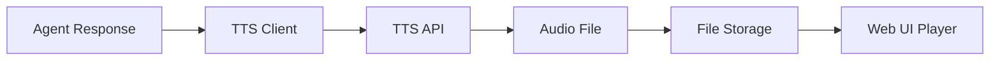
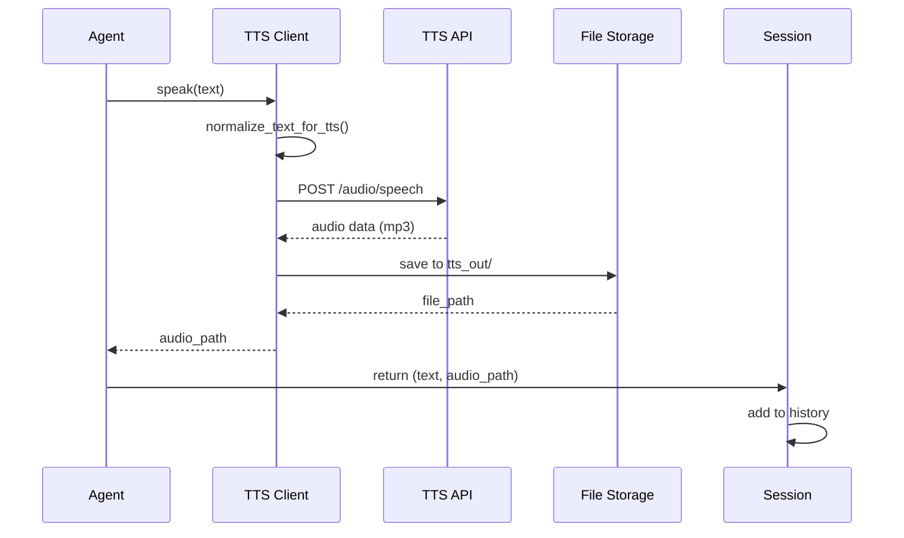

# ChatMode Voice & Audio System

This document covers text-to-speech (TTS) integration, audio generation, playback, and voice configuration.

---

## Overview

ChatMode supports optional text-to-speech synthesis for agent responses, creating a more immersive conversational experience. Audio is generated using OpenAI-compatible TTS APIs.



---

## TTS Configuration

### Enable TTS

Set these environment variables in `.env`:

```env
TTS_ENABLED=true
TTS_BASE_URL=https://api.openai.com/v1
TTS_API_KEY=sk-your-key-here
TTS_MODEL=tts-1
TTS_VOICE=alloy
TTS_OUTPUT_DIR=./tts_out
```

### Available Voices (OpenAI TTS)

| Voice | Characteristics | Use Case |
|-------|-----------------|----------|
| `alloy` | Balanced, neutral | General purpose |
| `echo` | Masculine, clear | Professional, authoritative |
| `fable` | Warm, expressive | Storytelling, narration |
| `onyx` | Deep, authoritative | Serious, formal |
| `nova` | Feminine, energetic | Enthusiastic, upbeat |
| `shimmer` | Soft, gentle | Calm, soothing |

### Per-Agent Voice Override

Agents can have custom voices in their profile:

```json
{
    "name": "Dr. Sophia Chen",
    "model": "gpt-4o-mini",
    "api": "openai",
    "conversing": "You are Dr. Sophia Chen...",
    "speak_model": {
        "voice": "nova",
        "model": "tts-1-hd"
    }
}
```

**Fields:**
- `voice` – Voice ID (see table above)
- `model` – Optional: `tts-1` (fast) or `tts-1-hd` (higher quality)

---

## Audio Generation Flow

### Message-to-Audio Pipeline



### Text Normalization

Before sending to TTS, text is normalized:

```python
def normalize_text_for_tts(text: str) -> str:
    """
    Remove markdown and special characters that TTS can't handle.
    """
    # Remove markdown bold/italic
    text = re.sub(r'\*\*(.+?)\*\*', r'\1', text)
    text = re.sub(r'\*(.+?)\*', r'\1', text)
    
    # Remove markdown links [text](url) -> text
    text = re.sub(r'\[(.+?)\]\(.+?\)', r'\1', text)
    
    # Collapse whitespace
    text = re.sub(r'\s+', ' ', text)
    
    return text.strip()
```

### File Storage

Audio files are saved with unique names:

```
tts_out/
├── agent_lawyer_20240130_120015_a1b2c3.mp3
├── agent_scientist_20240130_120032_d4e5f6.mp3
└── agent_philosopher_20240130_120045_g7h8i9.mp3
```

**Naming format:**
```
{agent_id}_{timestamp}_{random_id}.mp3
```

---

## TTS API Integration

### OpenAI TTS

```python
import requests

response = requests.post(
    f"{TTS_BASE_URL}/audio/speech",
    headers={
        "Authorization": f"Bearer {TTS_API_KEY}",
        "Content-Type": "application/json"
    },
    json={
        "model": "tts-1",
        "voice": "alloy",
        "input": "Hello, this is a test message.",
        "response_format": "mp3",
        "speed": 1.0
    }
)

with open("output.mp3", "wb") as f:
    f.write(response.content)
```

### Custom TTS Endpoints

ChatMode supports any OpenAI-compatible TTS endpoint:

```env
# Example: Local TTS server
TTS_BASE_URL=http://localhost:8080/v1
TTS_API_KEY=not-needed
TTS_MODEL=tts-1
```

---

## Audio Playback

### Web UI Player

The unified web interface includes an audio player for each message:

```html
<!-- Auto-generated for each message with audio -->
<div class="message">
    <div class="message-header">
        <strong>Dr. Sophia Chen</strong>
        <span class="timestamp">12:30 PM</span>
    </div>
    <div class="message-content">
        From a philosophical perspective, consciousness requires...
    </div>
    <audio controls src="/audio/tts_out/agent_philosopher_20240130_123000_xyz.mp3">
        Your browser does not support audio playback.
    </audio>
</div>
```

### Audio Endpoint

The web server serves audio files via:

```
GET /audio/tts_out/{filename}
```

**Security notes:**
- Path traversal protection (filename validation)
- MIME type detection
- Range request support for seeking

---

## TTS Performance

### Response Time

| Model | Quality | Speed | Use Case |
|-------|---------|-------|----------|
| `tts-1` | Good | ~500ms | Real-time conversations |
| `tts-1-hd` | Excellent | ~1-2s | Pre-recorded content |

### Caching Strategy

Audio files are cached on disk:

1. **Generate once** per unique (text, voice, model) combination
2. **Reuse** if exact text appears again
3. **Clean up** old files periodically

### Cost Optimization

**OpenAI TTS Pricing (example):**
- $15 per million characters

**Tips to reduce costs:**
1. Set `TTS_ENABLED=false` during development
2. Use shorter agent responses (`MAX_OUTPUT_TOKENS=256`)
3. Cache aggressively
4. Consider local TTS alternatives (Coqui, Bark)

---

## Disabling TTS

### Global Disable

```env
TTS_ENABLED=false
```

### Per-Agent Disable

Remove `speak_model` from agent profile:

```json
{
    "name": "Silent Agent",
    "model": "gpt-4o-mini",
    "api": "openai",
    "conversing": "..."
    // No speak_model = no TTS for this agent
}
```

---

## Troubleshooting

### TTS Not Working

**Check configuration:**
```bash
# Verify TTS_ENABLED is set
grep TTS_ENABLED .env

# Test API connection
curl -X POST https://api.openai.com/v1/audio/speech \
  -H "Authorization: Bearer $OPENAI_API_KEY" \
  -H "Content-Type: application/json" \
  -d '{
    "model": "tts-1",
    "input": "Test",
    "voice": "alloy"
  }' --output test.mp3
```

### Audio Not Playing

**Check file permissions:**
```bash
ls -la tts_out/
chmod 644 tts_out/*.mp3
```

**Check web server is serving audio:**
```bash
curl -I http://localhost:8000/audio/tts_out/test.mp3
```

### Poor Audio Quality

1. Switch to `tts-1-hd` model:
```json
{
  "speak_model": {
    "model": "tts-1-hd",
    "voice": "nova"
  }
}
```

2. Improve text normalization (remove special characters)

3. Adjust `TEMPERATURE` to produce cleaner text

### High Latency

1. Use `tts-1` instead of `tts-1-hd`
2. Keep `MAX_OUTPUT_TOKENS` low (256-512)
3. Consider local TTS server for lower latency

---

## Storage Management

### Audio Directory

```bash
# Check disk usage
du -sh tts_out/

# Archive old files
tar -czf tts_archive_$(date +%Y%m%d).tar.gz tts_out/*.mp3
mv tts_archive_*.tar.gz archives/

# Clean up
rm tts_out/*.mp3
```

### Auto-Cleanup Script

```bash
#!/bin/bash
# clean_old_audio.sh
# Remove audio files older than 7 days

find tts_out -name "*.mp3" -mtime +7 -delete
echo "Cleaned audio files older than 7 days"
```

Add to crontab:
```bash
# Run daily at 2 AM
0 2 * * * /path/to/clean_old_audio.sh
```

---

## Alternative TTS Solutions

### Local TTS with Coqui

```bash
# Install Coqui TTS
pip install TTS

# Run local TTS server
tts-server --model_name tts_models/en/ljspeech/tacotron2-DDC
```

Update `.env`:
```env
TTS_BASE_URL=http://localhost:5002/v1
TTS_ENABLED=true
```

### Bark (Open Source)

```python
from bark import SAMPLE_RATE, generate_audio, preload_models

preload_models()

text = "Hello, I am Bark."
audio_array = generate_audio(text)

# Save to file
import scipy.io.wavfile as wavfile
wavfile.write("output.wav", SAMPLE_RATE, audio_array)
```

---

*See also: [Configuration](./CONFIG.md) | [Architecture](./ARCHITECTURE.md) | [Setup Guide](./SETUP.md)*
